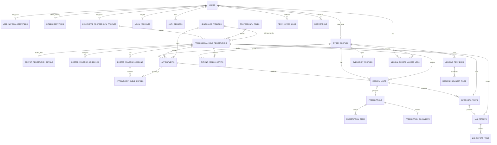

# HealthLink — Synchronized System + Database Design and Full Implementation Plan V6

> **Status:** Authoritative implementation baseline  
> **Supersedes:** V5 implementation plan and the separate Appointment/Serial workflow document where they conflict  
> **Architecture:** Modular monolith  
> **Backend:** FastAPI + `fastapi[standard]` + SQLAlchemy ORM + Pydantic + Alembic  
> **Frontend:** Next.js App Router + TypeScript/TSX + Tailwind CSS  
> **Database:** Neon hosted PostgreSQL  
> **Authentication:** JWT access token + revocable refresh sessions  
> **AI:** OpenAI API from backend only  
> **Development method:** Vertical feature slices from database through browser workflow

---

# 1. Development Rule

Except for the initial foundation, a phase is not complete until its feature works end-to-end:

```text
Database design
    ↓
SQLAlchemy model
    ↓
Alembic migration
    ↓
Pydantic schemas
    ↓
Repository
    ↓
Service / business logic
    ↓
FastAPI endpoint
    ↓
Frontend types
    ↓
Frontend API integration
    ↓
Next.js TSX UI
    ↓
Authorization
    ↓
Tests
    ↓
Browser acceptance test
```

Do not implement only backend pieces and move on.

Do not build future feature logic in an earlier phase unless it is a small shared dependency required by the current phase.

---

# 2. Final Product Architecture

```text
┌──────────────────────────────────────────────────────┐
│                     Next.js                          │
│             TypeScript + TSX + Tailwind              │
│                                                      │
│  Citizen Portal   Professional Portal   Admin Portal │
└────────────────────────┬─────────────────────────────┘
                         │ HTTPS REST
                         ▼
┌──────────────────────────────────────────────────────┐
│                      FastAPI                         │
│                                                      │
│ Auth / Identity / Citizen / Professional / Admin     │
│ Facilities / Doctors / Appointments / Chamber Queue  │
│ Visits / Prescriptions / Diagnostics / Lab Reports   │
│ Reminders / Emergency / Audit / AI                   │
│                                                      │
│ Route → Service → Repository → SQLAlchemy            │
└───────────────┬─────────────────────────┬────────────┘
                │                         │
                ▼                         ▼
        ┌─────────────────┐       ┌─────────────────┐
        │ Neon PostgreSQL │       │   OpenAI API    │
        └─────────────────┘       └─────────────────┘
```

Use a **modular monolith**. Do not introduce microservices for this project.

---

# 3. Three Portal Model

Frontend areas:

```text
/citizen/*
/professional/*
/admin/*
```

Login interfaces:

```text
/citizen/login
/professional/login
/admin/login
```

## Citizen Login

```text
Email + Password
```

Requires a `citizen_profiles` row.

## Professional Login

```text
NID + Password + Professional Role dropdown
```

Requires a matching `professional_role_registrations` row.

Clinical privileges require:

```text
verification_status = VERIFIED
```

## Admin Login

```text
Email + Password
```

Requires an active `admin_accounts` row.

Admins are not publicly registrable.

---

# 4. Identity Architecture

```text
users
│
├── user_national_identifiers          optional globally
│
├── citizen_profiles                   optional
│   └── citizen_identifiers
│
├── healthcare_professional_profiles   optional
│   └── professional_role_registrations
│       └── doctor_registration_details when role = DOCTOR
│
└── admin_accounts                     trusted operational capability
```

Core invariants:

```text
One base user identity.

Citizen may register with NID OR Birth Certificate Number.

Birth Certificate Number is citizen-only.

Professional registration always requires NID.

NID is stored once and globally unique.

BCN is globally unique.

BCN citizen may add NID once later.

Professional may hold multiple independently verified roles.

Professional session has one active role context.
```

---

# 5. Core Authentication Tables

## `users`

```text
id UUID PK
email VARCHAR(320) UNIQUE NOT NULL
password_hash VARCHAR(255) NOT NULL
first_name VARCHAR(100) NOT NULL
last_name VARCHAR(100) NOT NULL
is_active BOOLEAN NOT NULL DEFAULT TRUE
created_at TIMESTAMPTZ NOT NULL
updated_at TIMESTAMPTZ NOT NULL
```

Do not put NID, BCN, professional role, or medical data directly on `users`.

## `auth_sessions`

```text
id UUID PK
user_id UUID FK -> users.id NOT NULL
portal VARCHAR(32) NOT NULL
active_professional_role_registration_id UUID NULL
refresh_token_hash VARCHAR(255) UNIQUE NOT NULL
expires_at TIMESTAMPTZ NOT NULL
revoked_at TIMESTAMPTZ NULL
last_used_at TIMESTAMPTZ NULL
created_at TIMESTAMPTZ NOT NULL
```

Raw refresh tokens are never stored.

---

# 6. Citizen Identity Tables

## `user_national_identifiers`

```text
id UUID PK
user_id UUID FK -> users.id UNIQUE NOT NULL
nid_number VARCHAR(32) UNIQUE NOT NULL
created_at TIMESTAMPTZ NOT NULL
updated_at TIMESTAMPTZ NOT NULL
```

This is the single authoritative NID location.

## `citizen_profiles`

```text
id UUID PK
user_id UUID FK -> users.id UNIQUE NOT NULL
date_of_birth DATE NOT NULL
gender VARCHAR(32) NOT NULL
blood_group VARCHAR(8) NULL
address TEXT NULL
created_at TIMESTAMPTZ NOT NULL
updated_at TIMESTAMPTZ NOT NULL
```

## `citizen_identifiers`

```text
id UUID PK
user_id UUID FK -> users.id UNIQUE NOT NULL
national_identifier_id UUID FK -> user_national_identifiers.id UNIQUE NULL
birth_certificate_number VARCHAR(64) UNIQUE NULL
registered_with VARCHAR(32) NOT NULL
nid_added_at TIMESTAMPTZ NULL
created_at TIMESTAMPTZ NOT NULL
updated_at TIMESTAMPTZ NOT NULL
```

Database constraint:

```sql
CHECK (
    national_identifier_id IS NOT NULL
    OR birth_certificate_number IS NOT NULL
)
```

Initial citizen registration must provide exactly one:

```text
NID XOR BCN
```

After BCN→NID upgrade, both may exist.

---

# 7. Citizen One-Time NID Upgrade

Endpoint:

```text
POST /api/v1/citizens/me/identity/add-nid
```

Request:

```json
{
  "nid_number": "...",
  "confirmation": "CONFIRM"
}
```

Required:

```text
citizen has BCN
NID currently absent
confirmation exactly CONFIRM
submitted NID globally unique
```

After success:

```text
NID stored
BCN retained
nid_added_at set
normal self-service cannot replace NID
```

Problems are resolved through admin identity support.

---

# 8. Professional Role Architecture

## `healthcare_professional_profiles`

```text
id UUID PK
user_id UUID FK -> users.id UNIQUE NOT NULL
created_at TIMESTAMPTZ NOT NULL
updated_at TIMESTAMPTZ NOT NULL
```

## `professional_roles`

```text
id UUID PK
code VARCHAR(64) UNIQUE NOT NULL
name VARCHAR(100) NOT NULL
description TEXT NULL
is_active BOOLEAN NOT NULL DEFAULT TRUE
```

Seed:

```text
DOCTOR
LAB_TECHNICIAN
NURSE
PHARMACIST
RADIOLOGY_TECHNICIAN
OTHER_HEALTHCARE_PROFESSIONAL
```

## `professional_role_registrations`

```text
id UUID PK
professional_id UUID FK -> healthcare_professional_profiles.id NOT NULL
role_id UUID FK -> professional_roles.id NOT NULL
facility_id UUID FK -> healthcare_facilities.id NULL
facility_name_submitted VARCHAR(255) NOT NULL
designation VARCHAR(150) NOT NULL
additional_info TEXT NULL
verification_status VARCHAR(32) NOT NULL DEFAULT 'PENDING'
submitted_at TIMESTAMPTZ NOT NULL
verified_at TIMESTAMPTZ NULL
verified_by UUID FK -> users.id NULL
rejected_at TIMESTAMPTZ NULL
rejection_reason TEXT NULL
created_at TIMESTAMPTZ NOT NULL
updated_at TIMESTAMPTZ NOT NULL
```

Constraint:

```text
UNIQUE(professional_id, role_id)
```

Statuses:

```text
PENDING
VERIFIED
REJECTED
```

A VERIFIED role registration is the role assignment. No separate professional-role-assignment table is needed.

---

# 9. Doctor Registration Data

## `doctor_registration_details`

```text
id UUID PK
professional_role_registration_id UUID
    FK -> professional_role_registrations.id
    UNIQUE NOT NULL
bmdc_registration_number VARCHAR(100) UNIQUE NOT NULL
created_at TIMESTAMPTZ NOT NULL
updated_at TIMESTAMPTZ NOT NULL
```

Doctor registration requires:

```text
NID
Role = DOCTOR
BM&DC Registration Number
Medical Facility Name
Designation
Additional Information
```

Other professional roles require:

```text
NID
Selected Role
Medical Facility Name
Designation
Additional Information
```

BCN is never part of professional registration.

---

# 10. Facilities

## `healthcare_facilities`

```text
id UUID PK
name VARCHAR(200) NOT NULL
facility_type VARCHAR(50) NOT NULL
registration_number VARCHAR(100) NULL
address TEXT NOT NULL
phone VARCHAR(32) NULL
email VARCHAR(320) NULL
is_active BOOLEAN NOT NULL DEFAULT TRUE
created_at TIMESTAMPTZ NOT NULL
updated_at TIMESTAMPTZ NOT NULL
```

Facility types:

```text
HOSPITAL
CLINIC
DIAGNOSTIC_CENTER
PHARMACY
```

Admin verification links the submitted professional facility name to an existing facility or creates a facility record.

For the initial doctor appointment implementation, one professional role registration has one primary facility.

---

# 11. Admin Architecture

## `admin_accounts`

```text
id UUID PK
user_id UUID FK -> users.id UNIQUE NOT NULL
is_super_admin BOOLEAN NOT NULL DEFAULT FALSE
is_active BOOLEAN NOT NULL DEFAULT TRUE
created_at TIMESTAMPTZ NOT NULL
updated_at TIMESTAMPTZ NOT NULL
```

## `admin_action_logs`

```text
id UUID PK
admin_user_id UUID FK -> users.id NOT NULL
action_type VARCHAR(100) NOT NULL
target_user_id UUID FK -> users.id NULL
target_resource_type VARCHAR(100) NULL
target_resource_id UUID NULL
reason TEXT NULL
created_at TIMESTAMPTZ NOT NULL
```

Core admin responsibilities:

```text
Professional verification
Facility matching/creation
Citizen identity support
Administrative audit review
```

---

# 12. Professional Capability Map

Initial backend capability map:

```text
DOCTOR
------
SEARCHABLE_PROVIDER
MANAGE_PRACTICE_SCHEDULE
RECEIVE_APPOINTMENTS
RUN_CHAMBER_SESSION
VIEW_CURRENT_PATIENT
CREATE_MEDICAL_VISIT
CREATE_PRESCRIPTION
EDIT_OWN_PRESCRIPTION
REQUEST_DIAGNOSTIC_TEST
VIEW_AUTHORIZED_LAB_REPORT
VIEW_CURRENT_PATIENT_EMERGENCY_PROFILE


LAB_TECHNICIAN
--------------
VIEW_ASSIGNED_DIAGNOSTIC_TEST
CREATE_LAB_REPORT
EDIT_DRAFT_LAB_REPORT
FINALIZE_LAB_REPORT


NURSE
-----
No clinical write workflow until explicitly designed.


PHARMACIST
----------
No pharmacy dispensing/inventory workflow in current scope.


RADIOLOGY_TECHNICIAN
--------------------
Reserved for later diagnostic workflow.


OTHER_HEALTHCARE_PROFESSIONAL
-----------------------------
No clinical capability until explicitly assigned.
```

Frontend visibility never replaces backend permission checks.

---

# 13. Doctor Search Model

Citizens search only VERIFIED doctors.

Searchable fields:

```text
doctor name
hospital / medical facility name
```

Optional within-scope filters:

```text
specialization
practice weekday
```

Endpoint:

```text
GET /api/v1/doctors
```

Examples:

```text
?name=Rahman
?facility=Medical College
?name=Rahman&facility=Medical College
```

Never expose NID.

---

# 14. Doctor Practice Schedule

The previous generic `professional_availability` design is replaced for the first implementation by doctor-specific chamber schedules.

## `doctor_practice_schedules`

```text
id UUID PK
doctor_role_registration_id UUID
    FK -> professional_role_registrations.id
    NOT NULL
day_of_week SMALLINT NOT NULL
start_time TIME NOT NULL
end_time TIME NOT NULL
max_patients INTEGER NOT NULL
is_active BOOLEAN NOT NULL DEFAULT TRUE
created_at TIMESTAMPTZ NOT NULL
updated_at TIMESTAMPTZ NOT NULL
```

Constraints:

```text
0 <= day_of_week <= 6
start_time < end_time
max_patients > 0

UNIQUE(
    doctor_role_registration_id,
    day_of_week
)
```

Initial model assumes one chamber period per weekday for the doctor's verified role/facility.

---

# 15. Appointment Model

Booking is **serial-based**, not fixed-slot-based.

## `appointments`

```text
id UUID PK
citizen_id UUID FK -> citizen_profiles.id NOT NULL
doctor_role_registration_id UUID
    FK -> professional_role_registrations.id
    NOT NULL
facility_id UUID FK -> healthcare_facilities.id NOT NULL
appointment_date DATE NOT NULL
serial_number INTEGER NOT NULL
status VARCHAR(32) NOT NULL
reason TEXT NULL
booked_at TIMESTAMPTZ NOT NULL
cancelled_at TIMESTAMPTZ NULL
completed_at TIMESTAMPTZ NULL
created_at TIMESTAMPTZ NOT NULL
updated_at TIMESTAMPTZ NOT NULL
```

Statuses:

```text
BOOKED
CANCELLED
COMPLETED
REMOVED_BY_DOCTOR
NO_SHOW
```

Unique serial:

```text
UNIQUE(
    doctor_role_registration_id,
    facility_id,
    appointment_date,
    serial_number
)
```

---

# 16. Serial Assignment — MAX Rule

For the selected doctor/facility/date:

```text
new_serial = MAX(existing serial_number) + 1
```

If none exists:

```text
serial = 1
```

Cancelled serials are never reused.

Example:

```text
Issued: 1,2,3,4,5
Serial 3 cancelled
Next booking → serial 6
```

Daily capacity is based on active appointments, not MAX(serial).

Example:

```text
max_patients = 5
issued serials = 1..5
serial 3 cancels
active count = 4
new booking allowed
new serial = 6
```

---

# 17. Booking Concurrency

Capacity and MAX serial assignment must be atomic.

Recommended PostgreSQL approach:

```text
BEGIN
    acquire transaction-scoped advisory lock
    key = doctor_role_registration_id + appointment_date

    load applicable practice schedule
    count active appointments
    verify active_count < max_patients

    read MAX(serial_number)
    create appointment

    get/create daily practice session
    create queue entry

COMMIT
```

Database unique constraints remain the final duplicate-serial protection.

Do not rely on a frontend capacity check.

---

# 18. Daily Doctor Practice Session

A daily session acts as the queue container.

## `doctor_practice_sessions`

```text
id UUID PK
doctor_role_registration_id UUID
    FK -> professional_role_registrations.id
    NOT NULL
facility_id UUID FK -> healthcare_facilities.id NOT NULL
session_date DATE NOT NULL
status VARCHAR(32) NOT NULL DEFAULT 'NOT_STARTED'
started_at TIMESTAMPTZ NULL
ended_at TIMESTAMPTZ NULL
created_at TIMESTAMPTZ NOT NULL
updated_at TIMESTAMPTZ NOT NULL
```

Statuses:

```text
NOT_STARTED
ACTIVE
COMPLETED
```

Constraint:

```text
UNIQUE(
    doctor_role_registration_id,
    facility_id,
    session_date
)
```

The session may be created when the first patient books or lazily when the doctor starts practice.

---

# 19. Appointment Queue

## `appointment_queue_entries`

```text
id UUID PK
appointment_id UUID FK -> appointments.id UNIQUE NOT NULL
practice_session_id UUID
    FK -> doctor_practice_sessions.id
    NOT NULL
queue_status VARCHAR(32) NOT NULL DEFAULT 'WAITING'
became_current_at TIMESTAMPTZ NULL
finished_at TIMESTAMPTZ NULL
removed_at TIMESTAMPTZ NULL
created_at TIMESTAMPTZ NOT NULL
updated_at TIMESTAMPTZ NOT NULL
```

Queue statuses:

```text
WAITING
CURRENT
SKIPPED
DONE
REMOVED
CANCELLED
```

Serial number is read from the linked `appointments` row.

Do not duplicate it in the queue table.

Recommended PostgreSQL partial unique index:

```sql
CREATE UNIQUE INDEX uq_one_current_queue_entry_per_session
ON appointment_queue_entries (practice_session_id)
WHERE queue_status = 'CURRENT';
```

This guarantees at most one current patient for a chamber session.

---

# 20. Queue Semantics

Active queue:

```text
WAITING
CURRENT
```

Inactive queue:

```text
SKIPPED
DONE
REMOVED
CANCELLED
```

Next patient:

```text
lowest appointments.serial_number
where queue_status = WAITING
```

No serial renumbering.

---

# 21. Citizen Appointment Cancellation

Citizen can self-cancel only while the appointment has not become the doctor's current consultation.

Endpoint:

```text
POST /api/v1/appointments/{id}/cancel
```

Transaction:

```text
verify ownership
verify appointment is cancellable

appointment.status = CANCELLED
appointment.cancelled_at = now()

queue_entry.queue_status = CANCELLED
queue_entry.removed_at = now()
```

Cancellation removes the patient from the active serial pool and frees daily capacity.

The appointment row is retained.

---

# 22. Doctor Chamber Queue Actions

## Start Practice

```text
POST /api/v1/professional/practice-sessions/start
```

Flow:

```text
verify active professional role = VERIFIED DOCTOR
load/create today's practice session
status = ACTIVE
select lowest WAITING serial
mark it CURRENT
```

## Skip Current Patient

```text
POST /api/v1/appointment-queue/{id}/skip
```

```text
CURRENT → SKIPPED
advance to next WAITING serial
```

A future `return-to-queue` action may change:

```text
SKIPPED → WAITING
```

but is optional.

## Remove from Serial

```text
POST /api/v1/appointment-queue/{id}/remove
```

```text
queue → REMOVED
appointment → REMOVED_BY_DOCTOR
advance if current
```

## Mark No-Show

```text
POST /api/v1/appointment-queue/{id}/mark-no-show
```

```text
appointment → NO_SHOW
queue → REMOVED
advance if current
```

Do not hard-delete historical appointments.

---

# 23. Current Patient Access Rule

Before the patient's turn, the doctor sees only limited queue/appointment information:

```text
patient display name
serial number
appointment reason
```

When:

```text
queue_status = CURRENT
+
practice_session.status = ACTIVE
+
session belongs to active doctor role
```

the doctor can view the current patient's:

```text
profile
medical history
previous visits
previous prescriptions
lab reports
emergency profile
```

Sensitive reads are audit logged.

This is the main appointment-derived clinical-access rule.

---

# 24. Manual Patient Access Grants

Manual patient-granted professional access may still exist as a premium/core privacy feature.

## `patient_access_grants`

```text
id UUID PK
citizen_id UUID FK -> citizen_profiles.id NOT NULL
professional_role_registration_id UUID
    FK -> professional_role_registrations.id
    NOT NULL
access_scope VARCHAR(50) NOT NULL
granted_at TIMESTAMPTZ NOT NULL
expires_at TIMESTAMPTZ NULL
revoked_at TIMESTAMPTZ NULL
created_at TIMESTAMPTZ NOT NULL
```

Do **not** create a long-lived appointment grant.

Normal chamber access is derived from the current queue context.

---

# 25. Medical Visit

## `medical_visits`

```text
id UUID PK
citizen_id UUID FK -> citizen_profiles.id NOT NULL
doctor_role_registration_id UUID
    FK -> professional_role_registrations.id
    NOT NULL
facility_id UUID FK -> healthcare_facilities.id NOT NULL
appointment_id UUID FK -> appointments.id UNIQUE NULL
visit_date TIMESTAMPTZ NOT NULL
chief_complaint TEXT NULL
clinical_notes TEXT NULL
diagnosis TEXT NULL
follow_up_instructions TEXT NULL
status VARCHAR(32) NOT NULL DEFAULT 'DRAFT'
finalized_at TIMESTAMPTZ NULL
created_at TIMESTAMPTZ NOT NULL
updated_at TIMESTAMPTZ NOT NULL
```

Only the current appointment doctor may create the chamber visit.

When the doctor finishes the appointment, the visit should be finalized.

---

# 26. Prescription Model

The prescription is structured data and the PDF is a generated representation.

## `prescriptions`

```text
id UUID PK
visit_id UUID FK -> medical_visits.id UNIQUE NOT NULL
citizen_id UUID FK -> citizen_profiles.id NOT NULL
author_doctor_role_registration_id UUID
    FK -> professional_role_registrations.id
    NOT NULL
diagnostic_information TEXT NULL
medical_advice TEXT NULL
notes TEXT NULL
created_at TIMESTAMPTZ NOT NULL
updated_at TIMESTAMPTZ NOT NULL
```

The prescription may be edited later only by its author doctor.

This is an intentional exception to ordinary finalized-record immutability.

Every post-appointment edit must be audit logged and must regenerate the PDF.

---

# 27. Prescription Medicines

## `prescription_items`

```text
id UUID PK
prescription_id UUID FK -> prescriptions.id NOT NULL
medicine_name VARCHAR(200) NOT NULL
dosage VARCHAR(100) NOT NULL
frequency VARCHAR(100) NOT NULL
duration VARCHAR(100) NOT NULL
instructions TEXT NULL
```

Frontend form supports dynamic:

```text
+ Add Medicine
Remove Medicine
```

---

# 28. Prescription PDF

## `prescription_documents`

```text
id UUID PK
prescription_id UUID FK -> prescriptions.id UNIQUE NOT NULL
storage_key VARCHAR(500) NOT NULL
file_name VARCHAR(255) NOT NULL
content_type VARCHAR(100) NOT NULL DEFAULT 'application/pdf'
file_size_bytes BIGINT NULL
generated_at TIMESTAMPTZ NOT NULL
updated_at TIMESTAMPTZ NOT NULL
```

PDF is generated from structured prescription data.

Recommended PDF content:

```text
HealthLink
Doctor Name
BM&DC Registration Number
Designation
Facility
Visit Date

Patient Name
Age/DOB
Serial Number

Medicines table

Diagnostic Information
Medical Advice
Notes
```

Do not include NID/BCN by default.

Citizen:

```text
read/download own PDF
cannot edit
```

Author doctor:

```text
read
edit structured prescription
regenerate PDF
```

Other professionals:

```text
may read only if independently authorized
never edit
```

---

# 29. Diagnostic Tests

Structured diagnostic tests remain separate from free-text diagnostic information written on the prescription.

## `diagnostic_tests`

```text
id UUID PK
citizen_id UUID FK -> citizen_profiles.id NOT NULL
visit_id UUID FK -> medical_visits.id NULL
requested_by_role_registration_id UUID
    FK -> professional_role_registrations.id
    NOT NULL
assigned_to_role_registration_id UUID
    FK -> professional_role_registrations.id
    NULL
facility_id UUID FK -> healthcare_facilities.id NULL
test_name VARCHAR(200) NOT NULL
instructions TEXT NULL
status VARCHAR(32) NOT NULL
created_at TIMESTAMPTZ NOT NULL
updated_at TIMESTAMPTZ NOT NULL
```

Statuses:

```text
REQUESTED
IN_PROGRESS
COMPLETED
CANCELLED
```

Doctor may create structured diagnostic requests from the consultation workspace.

---

# 30. Laboratory Reports

## `lab_reports`

```text
id UUID PK
diagnostic_test_id UUID FK -> diagnostic_tests.id UNIQUE NOT NULL
citizen_id UUID FK -> citizen_profiles.id NOT NULL
facility_id UUID FK -> healthcare_facilities.id NOT NULL
created_by_role_registration_id UUID
    FK -> professional_role_registrations.id
    NOT NULL
report_date TIMESTAMPTZ NOT NULL
summary TEXT NULL
status VARCHAR(32) NOT NULL DEFAULT 'DRAFT'
finalized_at TIMESTAMPTZ NULL
created_at TIMESTAMPTZ NOT NULL
updated_at TIMESTAMPTZ NOT NULL
```

## `lab_report_items`

```text
id UUID PK
lab_report_id UUID FK -> lab_reports.id NOT NULL
parameter_name VARCHAR(200) NOT NULL
result_value_text VARCHAR(200) NOT NULL
result_value_numeric NUMERIC NULL
unit VARCHAR(50) NULL
reference_range VARCHAR(100) NULL
flag VARCHAR(32) NULL
```

Lab trends are derived queries, not stored duplicate data.

---

# 31. Medical History

No duplicate `medical_history` table.

The timeline is derived from:

```text
medical_visits
prescriptions
diagnostic_tests
lab_reports
```

Citizen endpoint:

```text
GET /api/v1/citizens/me/medical-history
```

Professional endpoint requires:

```text
current patient access
OR
valid manual patient access grant
OR
author access to the professional's own authored record where appropriate
```

---

# 32. Emergency Profile

## `emergency_profiles`

```text
id UUID PK
citizen_id UUID FK -> citizen_profiles.id UNIQUE NOT NULL
allergies TEXT NULL
chronic_conditions TEXT NULL
current_medications TEXT NULL
emergency_contact_name VARCHAR(150) NULL
emergency_contact_phone VARCHAR(32) NULL
special_notes TEXT NULL
updated_at TIMESTAMPTZ NOT NULL
```

Blood group comes from `citizen_profiles`.

---

# 33. Reminders and Notifications

## `medicine_reminders`

```text
id UUID PK
citizen_id UUID FK -> citizen_profiles.id NOT NULL
prescription_item_id UUID FK -> prescription_items.id NULL
medicine_name VARCHAR(200) NOT NULL
start_date DATE NOT NULL
end_date DATE NULL
timezone VARCHAR(64) NOT NULL DEFAULT 'Asia/Dhaka'
is_active BOOLEAN NOT NULL DEFAULT TRUE
created_at TIMESTAMPTZ NOT NULL
updated_at TIMESTAMPTZ NOT NULL
```

## `medicine_reminder_times`

```text
id UUID PK
reminder_id UUID FK -> medicine_reminders.id NOT NULL
reminder_time TIME NOT NULL
UNIQUE(reminder_id, reminder_time)
```

## `notifications`

```text
id UUID PK
user_id UUID FK -> users.id NOT NULL
notification_type VARCHAR(32) NOT NULL
title VARCHAR(200) NOT NULL
message TEXT NOT NULL
scheduled_for TIMESTAMPTZ NULL
read_at TIMESTAMPTZ NULL
action VARCHAR(32) NOT NULL DEFAULT 'NONE'
acknowledged_at TIMESTAMPTZ NULL
snoozed_until TIMESTAMPTZ NULL
created_at TIMESTAMPTZ NOT NULL
```

Notification types:

```text
MEDICINE_REMINDER
APPOINTMENT_REMINDER
```

Appointment reminder uses `appointment_date` and doctor's practice schedule rather than fixed patient time slots.

---

# 34. Medical Record Access Audit

## `medical_record_access_logs`

```text
id UUID PK
actor_user_id UUID FK -> users.id NOT NULL
actor_professional_role_registration_id UUID
    FK -> professional_role_registrations.id
    NULL
citizen_id UUID FK -> citizen_profiles.id NOT NULL
facility_id UUID FK -> healthcare_facilities.id NULL
resource_type VARCHAR(50) NOT NULL
resource_id UUID NULL
action VARCHAR(32) NOT NULL
request_id UUID NULL
created_at TIMESTAMPTZ NOT NULL
```

Examples:

```text
VIEW
CREATE
UPDATE
FINALIZE
AI_ACCESS
```

Must log current-patient record access and author prescription edits.

---

# 35. AI Architecture

```text
Next.js
    ↓
FastAPI AI endpoint
    ↓
normal authorization
    ↓
minimal structured medical context
    ↓
OpenAI API
    ↓
Pydantic-validated structured result
```

AI features:

```text
Symptom Guidance
Prescription Explanation
Lab Report Explanation
Medical History Summary
Healthcare Chatbot
```

AI never directly changes:

```text
visit
diagnosis
prescription
lab result
appointment
queue
```

Do not send NID or BCN to OpenAI.

---

# 36. Final Core ERD



---

# 37. Final Backend Modules

```text
auth
identity
citizens
professionals
admin
facilities
doctors
appointments
chamber
access
medical_records
prescriptions
diagnostics
reminders
emergency
audit
ai
```

Recommended per-module structure:

```text
models
schemas
repository
service
routes
tests
```

Shared:

```text
core/config.py
core/security.py
core/permissions.py
core/exceptions.py
db/session.py
db/base.py
```

---

# 38. Final Frontend Areas

```text
src/app/
├── citizen/
│   ├── login/
│   ├── register/
│   ├── dashboard/
│   ├── profile/
│   ├── doctors/
│   ├── appointments/
│   ├── medical-history/
│   ├── prescriptions/
│   ├── diagnostic-tests/
│   ├── lab-reports/
│   ├── reminders/
│   ├── emergency-profile/
│   ├── privacy/
│   └── ai-assistant/
│
├── professional/
│   ├── login/
│   ├── register/
│   ├── verification-status/
│   ├── dashboard/
│   ├── practice-schedule/
│   ├── chamber/
│   ├── consultation/
│   ├── prescriptions/
│   └── diagnostics/
│
└── admin/
    ├── login/
    ├── dashboard/
    ├── professional-verification/
    ├── facilities/
    ├── identity-support/
    └── audit-history/
```

---

# 39. Environment Configuration

`backend/.env.example`:

```env
APP_NAME=HealthLink
APP_ENV=development
DEBUG=true

DATABASE_URL=

JWT_SECRET_KEY=
JWT_ALGORITHM=HS256
ACCESS_TOKEN_EXPIRE_MINUTES=30
REFRESH_TOKEN_EXPIRE_DAYS=7

OPENAI_API_KEY=

FRONTEND_URL=http://localhost:3000

PRESCRIPTION_STORAGE_BACKEND=local
PRESCRIPTION_STORAGE_PATH=
```

`frontend/.env.example`:

```env
NEXT_PUBLIC_API_BASE_URL=http://localhost:8000/api/v1
```

Never commit real:

```text
DATABASE_URL
JWT secret
OpenAI key
production storage credentials
```

---


# 39A. Dependency Manifest Policy

HealthLink is a modular monolith and must use a shared dependency manifest per application layer.

Backend Python dependencies are maintained in exactly one primary file:

```text
backend/requirements.txt
```

Do not maintain separate requirements files for individual flows or modules.

Do not create:

```text
requirements_auth.txt
requirements_citizen.txt
requirements_professional.txt
requirements_appointments.txt
requirements_prescriptions.txt
requirements_phase_*.txt
```

When a phase introduces a Python dependency:

```text
install it
use it in the implementation
add it to backend/requirements.txt
verify a fresh environment can install the project dependencies
```

Do not leave packages installed only in a developer virtual environment without recording them.

For the current project, runtime and development/test Python dependencies may remain in this single `backend/requirements.txt` for simplicity. Split production/dev requirement files only if explicitly requested later.

Frontend dependencies are maintained in:

```text
frontend/package.json
```

and its package-manager lockfile.

Do not create separate frontend dependency manifests for Citizen, Professional, Admin, appointment, chamber, prescription, or other flows.

Dependency ownership:

```text
backend/requirements.txt
    → FastAPI/backend/test Python dependencies

frontend/package.json
    → Next.js dependencies and devDependencies

frontend package-manager lockfile
    → reproducible resolved frontend dependency versions
```

Every phase that adds or removes a third-party package must update the appropriate shared dependency manifest in the same phase.

A phase is not complete if the code imports a third-party dependency that is missing from its manifest.

---

# 40. Required `.gitignore`

```gitignore
.env
.env.*
!.env.example

backend/.env
frontend/.env.local
frontend/.env.development.local
frontend/.env.production.local
frontend/.env.test.local

__pycache__/
*.py[cod]
.pytest_cache/
.mypy_cache/
.ruff_cache/
.coverage
htmlcov/
.venv/
venv/
env/
build/
dist/
*.egg-info/

node_modules/
.next/
out/
*.tsbuildinfo

*.log
logs/

.vscode/
.idea/

.DS_Store
Thumbs.db

*.db
*.sqlite
*.sqlite3

# Private generated prescriptions in local development
private_storage/
```

---

# 41. Agent Implementation Rules

Every implementation agent must:

```text
1. Inspect existing code/migrations first.
2. Implement only the current phase.
3. Use Alembic for every schema change.
4. Keep routes thin.
5. Put business rules in services.
6. Keep database access in repositories.
7. Treat backend authorization as authoritative.
8. Use active professional role registration for clinical permissions.
9. Never hard-delete clinical/appointment history for queue operations.
10. Test failures and unauthorized cases.
11. Remove mocks before phase completion.
12. Update docs after each phase.
13. Check git diff/status before commit.
```

---

# 42. PHASE 0 — Project Foundation

## Goal

Create the runnable monorepo.

## Backend

Initialize:

```text
FastAPI
SQLAlchemy
Alembic
Pydantic Settings
PostgreSQL driver
```

Implement:

```text
GET /health
```

Configure CORS, `/api/v1`, DB session, settings, exception handling.

## Frontend

Initialize:

```text
Next.js
TypeScript
App Router
Tailwind
ESLint
```

Create root layout, API configuration, basic loading/error components.

## Repository

Add `.gitignore`, `.env.example`, README, docs directory.

## Tests

Backend health endpoint and frontend build.

## Done

Both apps run, Alembic sees metadata, no secrets committed.

---

# 43. PHASE 1 — Shared JWT Authentication and Refresh Sessions

## Database

Create:

```text
users
auth_sessions
```

Do not add professional-role FK to auth session until professional roles exist.

## Backend

Implement:

```text
Argon2 password hashing
JWT access tokens
refresh token generation/hash
rotation
logout
logout-all
current user dependency
portal claim
```

Routes:

```text
POST /api/v1/auth/refresh
POST /api/v1/auth/logout
POST /api/v1/auth/logout-all
```

## Frontend

Implement API client, in-memory access token handling, refresh flow, portal-aware auth utilities.

## Tests

Hash/verify, expired JWT, refresh rotation, revoked session, logout-all.

## Done

Reusable auth infrastructure exists for all portals.

---

# 44. PHASE 2 — Citizen Registration and Login

## Database

Create:

```text
user_national_identifiers
citizen_profiles
citizen_identifiers
```

## Backend

Routes:

```text
POST /api/v1/auth/citizen/register
POST /api/v1/auth/citizen/login
GET  /api/v1/citizens/me
GET  /api/v1/citizens/me/identity
```

Registration requires exactly one:

```text
NID
OR
BCN
```

## Frontend

Create:

```text
/citizen/register
/citizen/login
/citizen/dashboard
```

Registration identity selector:

```text
NID
Birth Certificate Number
```

## Tests

NID registration, BCN registration, duplicate identity, both/neither rejected, login.

## Done

Citizen can create account and enter Citizen Portal.

---

# 45. PHASE 3 — Citizen Profile + One-Time BCN→NID Upgrade

## Backend

Routes:

```text
PUT  /api/v1/citizens/me/profile
POST /api/v1/citizens/me/identity/add-nid
```

Use row locking/transaction for one-time NID addition.

## Frontend

Create profile and identity page with typed `CONFIRM`.

Normal profile edit never exposes NID/BCN mutation.

## Tests

One-time add, duplicate NID, second add rejected, BCN retained.

## Done

BCN citizen can safely migrate to NID identity.

---

# 46. PHASE 4 — Professional Registration + Role Catalog

## Database

Create:

```text
healthcare_professional_profiles
professional_roles
professional_role_registrations
doctor_registration_details
```

Seed professional roles.

## Backend

Routes:

```text
POST /api/v1/auth/professional/register
POST /api/v1/professionals/me/onboard
```

New professional requires NID.

Doctor requires BM&DC number.

Existing citizen with same NID must authenticate and onboard instead of creating duplicate account.

## Frontend

Dynamic role-based registration form.

## Tests

Doctor registration, lab tech registration, no NID rejection, BM&DC requirements, duplicate role rejection.

## Done

Professional application exists in `PENDING`.

---

# 47. PHASE 5 — Admin Login and Admin Portal

## Database

Create:

```text
admin_accounts
admin_action_logs
```

## Backend

Trusted admin creation script.

Routes:

```text
POST /api/v1/auth/admin/login
GET  /api/v1/admin/me
```

## Frontend

Create:

```text
/admin/login
/admin/dashboard
```

## Tests

Admin login, normal user denied, inactive admin denied.

## Done

Trusted admin portal works.

---

# 48. PHASE 6 — Facility Registry + Professional Verification

## Database

Create:

```text
healthcare_facilities
```

Link role registrations through `facility_id`.

## Backend

Routes:

```text
GET  /api/v1/admin/professional-registrations
GET  /api/v1/admin/professional-registrations/{id}
POST /api/v1/admin/professional-registrations/{id}/verify
POST /api/v1/admin/professional-registrations/{id}/reject

GET  /api/v1/admin/facilities
POST /api/v1/admin/facilities
PUT  /api/v1/admin/facilities/{id}
```

Verification resolves facility and writes admin audit.

## Frontend

Admin verification queue/detail and facility management.

## Tests

Verify/reject, reason required, facility link/create, audit.

## Done

Professional role becomes VERIFIED or REJECTED.

---

# 49. PHASE 7 — Professional Login + Active Role Context

## Database

Add to `auth_sessions`:

```text
active_professional_role_registration_id
```

## Backend

Route:

```text
POST /api/v1/auth/professional/login
```

Input:

```text
NID
Password
Role
```

VERIFIED → full professional portal session.

PENDING/REJECTED → restricted verification-status session.

## Frontend

Create professional login, verification status, role-based dashboard shell.

## Tests

Doctor login, lab-tech login, wrong role, pending/rejected restriction.

## Done

One user can enter the professional portal under one selected verified role.

---

# 50. PHASE 8 — Admin Citizen Identity Support

## Backend

Routes:

```text
GET  /api/v1/admin/citizen-identities/search
GET  /api/v1/admin/citizen-identities/{user_id}
POST /api/v1/admin/citizen-identities/{user_id}/correct
```

Reason required. Uniqueness rechecked. No automatic account merging.

## Frontend

Admin identity support search/detail.

## Tests

NID correction, BCN correction, conflict rejection, audit.

## Done

Immutable identity problems have a controlled recovery path.

---

# 51. PHASE 9 — Doctor Search + Doctor Practice Schedule

## Database

Create:

```text
doctor_practice_schedules
```

## Backend

Citizen routes:

```text
GET /api/v1/doctors
GET /api/v1/doctors/{id}
GET /api/v1/doctors/{id}/practice-days
```

Doctor routes:

```text
GET  /api/v1/professionals/me/practice-schedule
POST /api/v1/professionals/me/practice-schedule
PUT  /api/v1/professionals/me/practice-schedule/{id}
DELETE /api/v1/professionals/me/practice-schedule/{id}
```

Search by doctor name and facility/hospital name.

Only VERIFIED doctors are searchable.

## Frontend

Citizen doctor search/detail.

Doctor schedule editor with weekday, start/end time, max patients.

## Tests

Search name, search facility, unverified doctor hidden, schedule validation, non-doctor denied.

## Done

Citizen can find doctors and see practice days; doctor controls chamber schedule/capacity.

---

# 52. PHASE 10 — Appointment Booking + MAX Serial Assignment

## Database

Create:

```text
appointments
doctor_practice_sessions
appointment_queue_entries
```

Add partial unique index for one CURRENT queue entry per session.

## Backend

Routes:

```text
POST /api/v1/appointments
GET  /api/v1/appointments/me
POST /api/v1/appointments/{id}/cancel
```

Booking:

```text
validate doctor schedule for selected weekday
advisory lock doctor/date
count active appointments
enforce max_patients
serial = MAX + 1
create appointment
get/create daily practice session
create WAITING queue entry
```

## Frontend

Doctor detail → choose date → booking confirmation → show assigned serial.

Citizen appointments page shows date, doctor, facility, serial, status.

## Tests

Serial 1, sequential serial, cancellation frees capacity, cancelled serial not reused, concurrent duplicate protection.

## Done

Citizen can book a doctor and receives a stable serial number.

---

# 53. PHASE 11 — Doctor Daily Chamber Session + Serial Queue

## Backend

Routes:

```text
POST /api/v1/professional/practice-sessions/start
GET  /api/v1/professional/practice-sessions/current

POST /api/v1/appointment-queue/{id}/skip
POST /api/v1/appointment-queue/{id}/remove
POST /api/v1/appointment-queue/{id}/mark-no-show

POST /api/v1/professional/practice-sessions/{id}/finish
```

Queue helper:

```text
advance_queue(session)
```

Always chooses lowest WAITING serial.

## Frontend

Create:

```text
/professional/chamber
```

Show current serial and waiting queue.

Actions:

```text
Open Patient
Skip
Remove
No Show
```

## Tests

Start picks lowest serial, skip advances, remove advances, cancelled omitted, only one CURRENT.

## Done

Doctor can run a real serial-based chamber queue.

---

# 54. PHASE 12 — Current Patient Clinical Access + Consultation Workspace

## Database

Create:

```text
patient_access_grants
medical_visits
```

`patient_access_grants` is for manual grants only.

## Backend

Implement authorization dependency:

```text
require_current_patient_access(...)
```

Full patient visibility requires current queue context or independent valid manual access.

Visit routes:

```text
POST /api/v1/citizens/{citizen_id}/visits
GET  /api/v1/visits/{id}
PUT  /api/v1/visits/{id}
```

## Frontend

Create consultation workspace with:

```text
patient profile
emergency summary placeholder until emergency phase
medical history
visit form
```

Before current serial, full medical information remains hidden.

## Tests

Current doctor allowed, waiting patient hidden, another doctor denied, non-doctor denied.

## Done

Doctor can safely consult only the current patient.

---

# 55. PHASE 13 — Chamber Prescription Form + Electronic PDF

## Database

Create:

```text
prescriptions
prescription_items
prescription_documents
```

## Backend

Routes:

```text
POST /api/v1/visits/{visit_id}/prescription
GET  /api/v1/prescriptions/{id}
PUT  /api/v1/prescriptions/{id}
GET  /api/v1/prescriptions/{id}/pdf
```

Implement storage abstraction:

```text
local private storage in development
object-storage adapter later/production
```

Prescription form fields:

```text
multiple medicines
diagnostic_information
medical_advice
notes
```

Author doctor only may edit.

Edit regenerates PDF.

## Frontend

Dynamic `+ Add Medicine` form.

Citizen prescription detail includes PDF view/download.

Doctor author sees Edit.

## Tests

Multiple medicines, citizen cannot edit, other doctor cannot edit, author edit regenerates PDF, PDF auth.

## Done

Consultation produces a structured prescription and electronic PDF in patient profile.

---

# 56. PHASE 14 — Finish Appointment + Automatic Next Serial

## Backend

Route:

```text
POST /api/v1/appointments/{id}/finish
```

Preconditions:

```text
appointment is CURRENT
active doctor owns appointment
medical visit exists
```

Recommended:

```text
prescription optional
```

because some visits may not require medicine.

Transaction:

```text
finalize visit
appointment → COMPLETED
queue → DONE
advance_queue()
```

Payment has no database model. Doctor presses Finish after handling offline chamber payment.

## Frontend

Consultation workspace:

```text
Finish Appointment
```

After success automatically navigates/updates to next serial.

## Tests

Finish current, visit finalized, next serial current, last patient leaves no current queue.

## Done

Doctor can complete one chamber visit and naturally move to the next serial.

---

# 57. PHASE 15 — Unified Medical History Timeline

## Database

No new table.

Derive from:

```text
visits
prescriptions
```

Later diagnostic/lab phases enrich automatically.

## Backend

Routes:

```text
GET /api/v1/citizens/me/medical-history
GET /api/v1/citizens/{id}/medical-history
```

Support pagination and filters.

## Frontend

Citizen timeline and doctor current-patient history view.

## Tests

Own history, current patient history, unauthorized denial, pagination/filtering.

## Done

Longitudinal medical history is usable without duplicate history storage.

---

# 58. PHASE 16 — Structured Diagnostic Test Requests

## Database

Create:

```text
diagnostic_tests
```

## Backend

Doctor routes:

```text
POST /api/v1/citizens/{citizen_id}/diagnostic-tests
GET  /api/v1/citizens/{citizen_id}/diagnostic-tests
```

Lab-tech routes:

```text
GET /api/v1/professionals/me/diagnostic-tests
PUT /api/v1/diagnostic-tests/{id}/status
```

Doctor may create requests during current-patient consultation.

## Frontend

Doctor consultation gets structured diagnostic request UI in addition to free-text prescription diagnostics.

Lab technician gets assigned tests page.

Citizen sees own requests.

## Tests

Doctor request, wrong role denied, lab-tech assignment validation, status transitions.

## Done

Structured doctor→diagnostic workflow works.

---

# 59. PHASE 17 — Lab Reports + Finalization + Trends

## Database

Create:

```text
lab_reports
lab_report_items
```

## Backend

Routes:

```text
POST /api/v1/diagnostic-tests/{id}/lab-report
PUT  /api/v1/lab-reports/{id}
POST /api/v1/lab-reports/{id}/finalize

GET /api/v1/citizens/me/lab-reports
GET /api/v1/lab-reports/{id}
GET /api/v1/citizens/me/lab-trends
```

Assigned VERIFIED LAB_TECHNICIAN writes/finalizes.

## Frontend

Lab report editor, citizen reports, trend chart.

## Tests

Draft/finalize, finalized edit rejected, numeric/text values, trend query.

## Done

Diagnostic workflow produces structured finalized lab results.

---

# 60. PHASE 18 — Emergency Medical Profile

## Database

Create:

```text
emergency_profiles
```

## Backend

Citizen:

```text
GET /api/v1/citizens/me/emergency-profile
PUT /api/v1/citizens/me/emergency-profile
```

Doctor:

```text
GET /api/v1/citizens/{id}/emergency-profile
```

Current-patient or manual grant required.

## Frontend

Citizen emergency profile.

Consultation workspace now displays current patient's emergency information.

## Tests

Citizen update, current doctor read, waiting/other doctor denied.

## Done

Current-patient workspace contains critical emergency information.

---

# 61. PHASE 19 — Medicine + Appointment Reminders and Notifications

## Database

Create:

```text
medicine_reminders
medicine_reminder_times
notifications
```

## Backend

Medicine reminder CRUD and notification APIs.

Job:

```text
python -m app.jobs.reminders
```

Appointment reminders use appointment date plus doctor practice schedule.

Generate idempotent notifications.

## Frontend

Citizen reminders and notifications pages.

## Tests

Multiple times, medicine reminder generation, appointment reminder generation, idempotency, snooze/taken.

## Done

Actual reminders execute, not just store configuration.

---

# 62. PHASE 20 — Medical Record Access Logging + Citizen Transparency

## Database

Create:

```text
medical_record_access_logs
```

## Backend

Central `AuditService`.

Integrate:

```text
current patient profile/history reads
visits
prescriptions
prescription edits
diagnostic tests
lab reports
emergency profile
AI context later
```

Citizen:

```text
GET /api/v1/citizens/me/access-history
```

## Frontend

Create:

```text
/citizen/privacy/access-history
```

## Tests

Current-patient access logged, prescription edit logged, own transparency only.

## Done

HealthLink can show who accessed records, role, facility, resource, and time.

---

# 63. PHASE 21 — Manual Patient Access Grants

## Goal

Provide optional explicit citizen-controlled access outside the active chamber queue.

## Backend

Routes:

```text
GET    /api/v1/citizens/me/access-grants
POST   /api/v1/citizens/me/access-grants
DELETE /api/v1/citizens/me/access-grants/{id}
```

Scopes:

```text
FULL_MEDICAL_HISTORY
VISITS_ONLY
PRESCRIPTIONS_ONLY
LAB_REPORTS_ONLY
EMERGENCY_PROFILE_ONLY
```

## Frontend

Citizen privacy/access-management page.

## Tests

Grant, expiry, revoke, scope enforcement, appointment access does not create permanent grant.

## Done

Citizens can intentionally grant/revoke limited record access.

---

# 64. PHASE 22 — AI Infrastructure

Install OpenAI dependency only now.

Backend:

```text
ai_service
ai_prompt_builder
structured schemas
timeout/error handling
```

Frontend shared AI components.

Mocked tests.

## Done

Secure backend-only OpenAI integration works once `OPENAI_API_KEY` is supplied.

---

# 65. PHASE 23 — AI Prescription Explanation

Endpoint:

```text
POST /api/v1/ai/prescriptions/{id}/explain
```

Use structured prescription only.

No NID/BCN.

Audit AI access.

Frontend button on citizen prescription.

## Done

Citizen gets grounded plain-language prescription explanation.

---

# 66. PHASE 24 — AI Lab Report Explanation

Endpoint:

```text
POST /api/v1/ai/lab-reports/{id}/explain
```

Use structured lab items, reference range, unit, flag.

No diagnosis.

Audit access.

## Done

Citizen gets grounded report explanation.

---

# 67. PHASE 25 — AI Medical History Summary

Endpoint:

```text
POST /api/v1/ai/citizens/{id}/medical-summary
```

Allowed:

```text
citizen self
current authorized doctor
manual-authorized doctor
```

Return source record references.

## Done

AI summary is traceable to HealthLink records.

---

# 68. PHASE 26 — AI Healthcare Chatbot

Endpoint:

```text
POST /api/v1/ai/chat
```

Modes:

```text
GENERAL
RECORD_AWARE
```

General mode loads no medical records automatically.

Record-aware mode requires explicit authorized record selection.

## Done

Privacy-aware healthcare chatbot works.

---

# 69. PHASE 27 — AI Symptom Guidance

Endpoint:

```text
POST /api/v1/ai/symptom-guidance
```

Structured non-diagnostic output:

```text
summary
general_information
red_flags
suggested_next_step
disclaimer
```

## Done

Non-diagnostic symptom guidance works safely.

---

# 70. PHASE 28 — Dashboard and UX Consolidation

## Citizen Dashboard

```text
upcoming appointment + serial
today's medicine reminders
recent prescription
latest lab report
medical history
emergency profile
AI assistant
```

## Doctor Dashboard

```text
today's chamber schedule
today's booking count / max
start practice
current/next serial
recent authored prescriptions
```

## Lab Technician Dashboard

```text
assigned tests
in-progress reports
draft/finalized reports
```

## Admin Dashboard

```text
pending professional verification
facilities
identity support
admin actions
```

All pages require loading/empty/error/success states.

## Done

System feels like three coherent products rather than disconnected screens.

---

# 71. PHASE 29 — Security Hardening

Test:

```text
wrong portal
wrong professional role
unverified professional
waiting patient medical access
another doctor's current patient
cross-citizen object IDs
prescription author-only edit
queue manipulation by wrong doctor
admin-only identity changes
refresh-token replay/revocation
AI context authorization
```

Review sensitive logs, CORS, JWT expiry, input limits, PDF authorization, local/private storage.

## Done

Critical healthcare-data boundaries are automated and tested.

---

# 72. PHASE 30 — Full End-to-End QA

## Citizen Journey

```text
register with BCN
login
later add NID with CONFIRM
search doctor by name/hospital
select practice date
book
receive serial
cancel another booking scenario
attend appointment
view completed visit
view prescription PDF
create reminder
view diagnostic request
view lab report/trends
use AI
view access history
```

## Doctor Journey

```text
register with NID + DOCTOR
enter BM&DC/facility/designation/info
admin verifies
login with NID/password/DOCTOR
set weekdays/start/end/max patients
receive bookings
start chamber
see lowest serial
open current patient
view profile/history/emergency
skip/no-show scenario
consult present patient
add medicine rows
write diagnostics info
write advice
generate prescription PDF
finish appointment
next serial appears
edit own prescription later
```

## Lab Technician Journey

```text
register
admin verify
role login
see assigned test
create report
finalize
citizen/doctor see result
```

## Admin Journey

```text
login
verify professional
create/link facility
reject another registration
resolve identity problem
view audit action
```

## Done

All critical workflows pass against PostgreSQL.

---

# 73. PHASE 31 — Production Deployment

## Neon

Set real:

```env
DATABASE_URL=
```

in deployment environment only.

Run:

```bash
alembic upgrade head
```

## Backend

Production environment:

```text
DEBUG=false
strong JWT secret
OpenAI key when enabled
frontend origin
private prescription storage configuration
```

## Frontend

Set:

```env
NEXT_PUBLIC_API_BASE_URL=<backend>/api/v1
```

## Reminder Job

Configure scheduled execution:

```text
python -m app.jobs.reminders
```

## Prescription PDFs

Use private production object storage or another protected persistent storage supported by deployment.

Never expose raw storage keys publicly without authorization.

## Verification

Test HTTPS, CORS, DB TLS, all three logins, queue, PDF auth, reminders, AI, audit.

## Done

Full HealthLink workflow works in production.

---

# 74. Updated Migration Sequence

Recommended logical order:

```text
001 users
002 auth_sessions

003 user_national_identifiers
004 citizen_profiles
005 citizen_identifiers

006 healthcare_professional_profiles
007 professional_roles
008 professional_role_registrations
009 doctor_registration_details

010 admin_accounts
011 admin_action_logs

012 healthcare_facilities
013 professional_role_registrations_add_facility_fk
014 auth_sessions_add_active_professional_role

015 doctor_practice_schedules

016 doctor_practice_sessions
017 appointments
018 appointment_queue_entries
019 queue_current_partial_unique_index

020 patient_access_grants
021 medical_visits

022 prescriptions
023 prescription_items
024 prescription_documents

025 diagnostic_tests
026 lab_reports
027 lab_report_items

028 emergency_profiles

029 medicine_reminders
030 medicine_reminder_times
031 notifications

032 medical_record_access_logs
```

Migrations may be grouped when tables are introduced in the same development phase, but the dependency order must remain valid.

---

# 75. High-Value Database Indexes

```text
users(email)

user_national_identifiers(nid_number)

citizen_identifiers(birth_certificate_number)

professional_role_registrations(
    professional_id,
    role_id,
    verification_status
)

healthcare_facilities(name)

doctor_practice_schedules(
    doctor_role_registration_id,
    day_of_week
)

appointments(
    doctor_role_registration_id,
    facility_id,
    appointment_date,
    status
)

appointments(
    citizen_id,
    appointment_date
)

appointment_queue_entries(
    practice_session_id,
    queue_status
)

medical_visits(
    citizen_id,
    visit_date
)

prescriptions(
    citizen_id,
    created_at
)

diagnostic_tests(
    citizen_id,
    status,
    created_at
)

lab_reports(
    citizen_id,
    report_date
)

medical_record_access_logs(
    citizen_id,
    created_at
)
```

---

# 76. Critical Service-Layer Invariants

Identity:

```text
Citizen initial registration = exactly one of NID/BCN.

Professional registration = NID only.

NID globally unique.

BCN globally unique.

BCN→NID self-service only once.

Normal profile editing never changes NID/BCN.
```

Professional:

```text
Role begins PENDING.

Clinical privileges require VERIFIED.

Doctor role requires BM&DC registration.

Professional login explicitly selects active role.
```

Appointment:

```text
Only VERIFIED DOCTOR is searchable/bookable.

Booking date must match active practice weekday.

Active booking count must be below max_patients.

Serial = MAX(previous serial) + 1.

Cancelled serial is never reused.

Cancellation frees capacity.

Queue actions never hard-delete appointment history.

At most one CURRENT queue entry per practice session.

Next patient = lowest WAITING serial.
```

Clinical:

```text
Full appointment-derived patient access only for CURRENT patient.

Doctor can only create chamber visit for current appointment.

Author doctor is the only professional allowed to edit a prescription.

Prescription edits regenerate PDF.

Citizen prescription is read-only.

Visit finalizes when appointment finishes.

Structured diagnostics are separate from free-text prescription diagnostics.

Only LAB_TECHNICIAN creates/finalizes initial lab workflow.
```

Security:

```text
No cross-patient browsing.

No wrong-role clinical access.

No secrets in frontend.

No NID/BCN in AI prompts.

Sensitive reads/edits are auditable.
```

---

# 77. Phase Definition of Done Checklist

For every applicable phase:

## Database

- [ ] SQLAlchemy model
- [ ] constraints
- [ ] indexes
- [ ] Alembic migration
- [ ] migration review
- [ ] upgrade succeeds
- [ ] downgrade considered

## Backend

- [ ] request schemas
- [ ] response schemas
- [ ] repository
- [ ] service
- [ ] routes
- [ ] authentication
- [ ] portal authorization
- [ ] professional-role authorization
- [ ] object authorization
- [ ] conflict handling
- [ ] tests

## Frontend

- [ ] TypeScript types
- [ ] real API client
- [ ] TSX page/components
- [ ] validation
- [ ] loading
- [ ] empty
- [ ] error
- [ ] success feedback
- [ ] responsive basic design

## Dependency Manifests

- [ ] `backend/requirements.txt` updated if Python dependencies changed
- [ ] `frontend/package.json` and lockfile updated if frontend dependencies changed
- [ ] no per-flow/per-phase dependency manifests introduced

## Integration

- [ ] real backend
- [ ] real PostgreSQL schema
- [ ] no feature mocks
- [ ] browser workflow works
- [ ] documentation updated

## Security

- [ ] unauthenticated test
- [ ] wrong portal test
- [ ] wrong role test
- [ ] wrong resource-owner test
- [ ] sensitive-data logging reviewed
- [ ] audit integration where required

---

# 78. Agent Workflow Per Phase

```text
1. git status
2. inspect existing models/migrations/services/routes/frontend/tests
3. write phase checklist
4. implement ORM
5. generate/review Alembic migration
6. apply migration
7. implement schemas/repository/service/routes
8. run backend tests
9. implement frontend types/API/UI
10. integrate real endpoint
11. manually test browser workflow
12. run authorization tests
13. update docs
14. git diff
15. git status
16. commit phase
```

Do not continue after a broken migration or broken authorization test.

---

# 79. Explicitly Outside Current Scope

```text
Online payment
Insurance
Telemedicine/video calling
Pharmacy inventory
Pharmacy dispensing
Hospital billing
PACS/medical imaging
FHIR/HL7 integration
Government NID API integration
Government analytics dashboard
Doctor ratings/reviews
Appointment marketplace ranking
AI diagnosis
AI treatment decisions
AI prescription creation
Permanent AI chat history
```

Chamber payment is explicitly **offline** and has no database/payment subsystem.

---

# 80. Final Updated Architecture Invariants

```text
ONE BASE USER IDENTITY

THREE LOGIN EXPERIENCES
    Citizen
    Professional
    Admin

CITIZEN
    NID or BCN

PROFESSIONAL
    NID
    selected professional role
    admin verification

DOCTOR
    BM&DC
    facility
    designation
    additional info
    practice weekdays
    chamber start/end time
    max patients/day

BOOKING
    doctor search by name/facility
    date-based booking
    stable MAX+1 serial
    cancellation removes from active pool
    historical appointment retained

CHAMBER
    daily practice session
    WAITING → CURRENT
    skip/remove/no-show/cancel ignored by next selection
    lowest WAITING serial becomes next CURRENT

CURRENT PATIENT
    full clinical/profile/emergency access
    audit logged

CONSULTATION
    structured visit
    medicines with + add rows
    free-text diagnostics
    medical advice
    optional structured diagnostic requests

PRESCRIPTION
    structured DB source of truth
    generated electronic PDF
    citizen read-only
    author doctor edit-only
    edit regenerates PDF

FINISH APPOINTMENT
    visit finalized
    appointment completed
    queue done
    next serial becomes current
    offline payment not modeled

MEDICAL HISTORY
    derived from structured records

AI
    explanatory only
    minimized context
    never authoritative

AUDIT
    sensitive medical access and edits recorded
```

This V6 document is the synchronized system design, database design, and implementation roadmap that should be used for implementation from this point forward.
