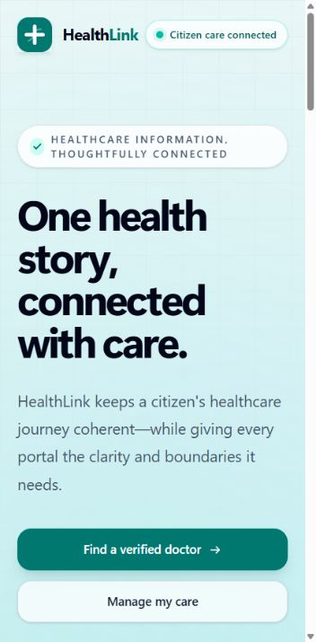
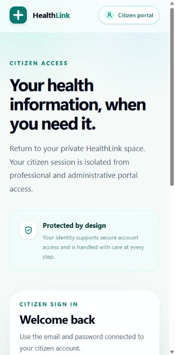
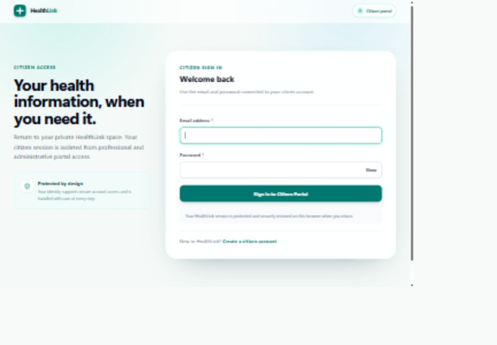
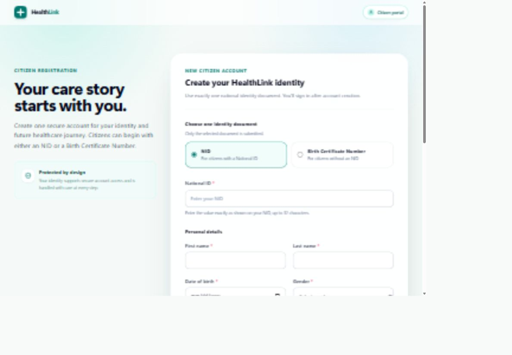
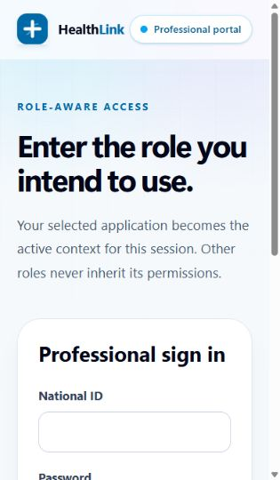
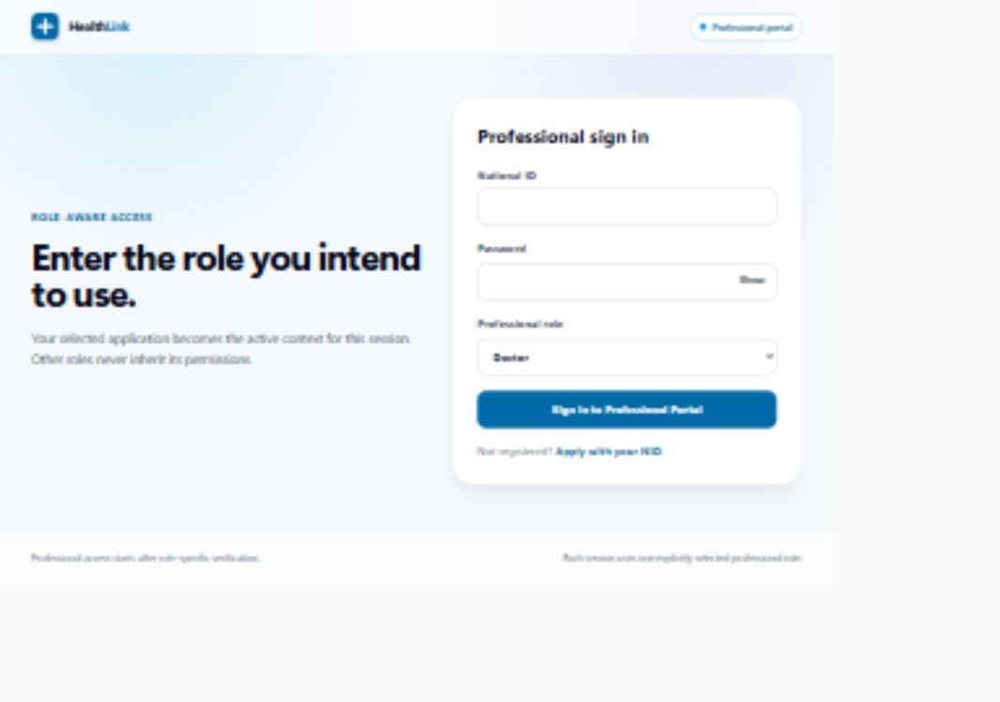
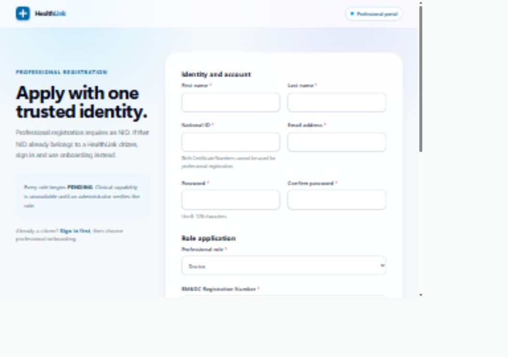
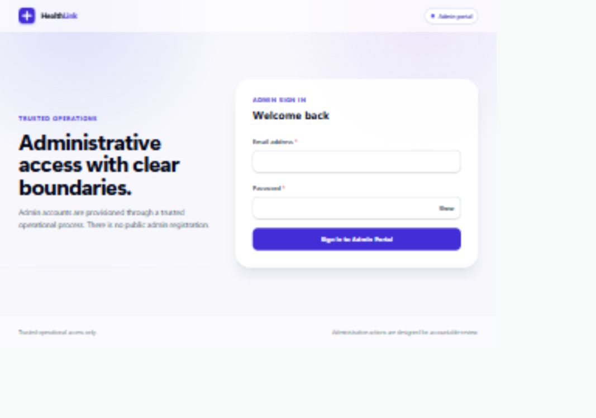

# HealthLink UI design audit and safe redesign plan

Started: 2026-09-08. Completed for the accessible scope: 2026-09-09.

Local source baseline: `884b606` — `feat(ux): apply phase 14 product audit improvements`.

Scope: existing Phase 0–14 interfaces. This is an audit and implementation handoff, not a redesign implementation, authorization to deploy, or permission to begin Phase 15.

## 1. Verdict

HealthLink has a recognizable brand, explicit portal boundaries, labeled forms, and useful safety improvements. Its presentation is still dominated by large introductions, oversized rounded panels, repeated reassurance, and technical language. These choices reduce the space available for the actual work and make unrelated tasks look equally important.

The recommended direction is a **quiet, task-first healthcare interface**: neutral backgrounds, restrained teal branding, consistent typography and controls, prominent next actions, and compact operational layouts. Premium should mean precise, readable, predictable, and trustworthy—not more gradients, animation, or decorative cards.

The highest priorities are:

1. Put sign-in controls and everyday tasks ahead of introductory content, especially on mobile.
2. Establish one shared visual system, with different densities for citizen and operational screens.
3. Reorganize clinician and administrator screens around their decisions, while retaining all existing safeguards.
4. Correct concrete presentation defects: an invalid consultation grid declaration, misleading filtered empty states, and incorrect professional page titles.
5. Validate authenticated layouts with test accounts before treating this as a completed end-to-end visual audit.

No application code, dependencies, database schema, environment configuration, or production deployment was changed during this audit.

## 2. Evidence and limitations

### Evidence collected in this audit

- Live public pages in the in-app browser, with eight saved and inspected screenshots below.
- Public-page accessibility-tree inspection, including professional sign-in and the citizen doctor-search access guard.
- Source inspection of all 25 page-route entry points and the principal UI components behind citizen, professional, and administrator workflows. The findings below identify relevant component files; this is not a security audit of every backend file.
- Local compiled CSS inspection and a browser CSS parser check of the consultation grid value. `CSS.supports('grid-template-columns', '260px,1fr')` returned `false`; the space-separated value returned `true`.
- Existing frontend scripts and GitHub Actions workflow inspection to define the future regression gates.

### What has not been verified

- No authenticated test session was available. Citizen care screens, doctor operations, and administrator tools were reviewed from source, not visually exercised with live data. A sign-in wall is not evidence of the protected page's appearance.
- Public captures show entry states, not successful registration, sign-in, or authenticated completion. No accounts, appointments, medical records, or administrative decisions were created in production.
- Desktop captures are scaled by the browser surface and visibly soft. They support broad composition findings only, not pixel-accurate type or contrast measurements. Narrow captures are clearer. These are viewport screenshots, not full-page captures.
- The inspected local revision is recorded above. This audit did not independently map the live Vercel deployment to a Git commit; live observations and source observations are therefore distinguished.
- No complete screen-reader, cross-browser, real-device, contrast-measurement, performance, or usability-study pass was run. There are no measured conversion or task-time claims here.
- Automated application tests were not rerun for this documentation-only audit. Earlier test results are not new evidence that a future redesign passes.

The Product Design audit workflow shaped this report: screenshots precede visual conclusions, source-only recommendations are explicitly labeled, and inaccessible flow stages remain named verification gaps.

## 3. Captured journey steps

These are entry points into separate journeys, not a claim that one user completed every journey consecutively.

### Step 1 — Homepage: needs hierarchy refinement

Strength: two relevant citizen actions are present and visually recognizable.

Issue: the oversized multiline headline and abstract explanation occupy most of the first screen. The first action sits near the bottom of the captured viewport. Copy about a coherent healthcare journey and portal boundaries is less useful here than a direct explanation of finding a doctor and managing appointments.

Recommendation: shorten the headline and supporting text, retain the existing doctor-search and citizen-care destinations, and present professional/admin entry as secondary navigation. Do not imply unauthenticated doctor search is supported when it currently requires citizen sign-in.

Accessibility risk/limit: large text itself is not an accessibility failure. The issue is reading effort and distance to the next action. Test reflow and keyboard navigation independently.

### Step 2 — Citizen sign-in: high-priority mobile improvement

Strength: visible labels, a distinct primary action, and a registration link provide a clear form once reached.

Issue: on the captured narrow screen, neither credential input is visible. The headline, portal-isolation explanation, and reassurance card precede the sign-in card. On desktop, the two-field form receives a large amount of framing and empty space.

Recommendation: form first on mobile; one concise heading, optional short supporting sentence, email, password, submit, and registration link. Keep portal identification in the header. Reduce desktop form width and decoration. Retain password visibility, loading feedback, and validated return destinations.

Accessibility risk/limit: moving the form visually must also make DOM reading and keyboard order sensible. Do not use CSS ordering that leaves assistive-technology users following a different sequence. Successful authentication was not tested.

### Step 3 — Citizen registration: workable structure, needs simplification

Strength: NID/BCN selection is explicit; personal fields have visible labels and required indicators.

Issue: a substantial promotional/reassurance column accompanies an already lengthy form. The form has multiple sections below the initial viewport. The main task should be clear without reading a separate explanation panel.

Recommendation: retain the existing identity, personal-details, and account-security groups, with concise document guidance next to the NID/BCN selector. Start with a well-grouped single form; a wizard is not required. If later selected, a wizard must preserve all entered values and the existing single registration transaction.

Accessibility risk/limit: source-level custom validation needs consistent error association and focus recovery. This capture does not prove validation or successful submission. Optional fields must remain optional.

### Step 4 — Professional sign-in: clear form, overly technical entry

Strength: the selected role is an explicit field rather than hidden context.

Issue: the first screen teaches internal permission concepts before presenting the complete form. The narrow capture shows only the beginning of the form. The browser title is also “Professional Registration” on the sign-in route; the professional layout sets that title for its children.

Recommendation: lead with “Professional sign in”; explain the role field in one short sentence. Keep NID, password, and the role choice. Add route-specific page titles. Never simplify the interface by dropping the selected-role requirement.

Accessibility risk/limit: inspect the password input's accessible name separately from its show/hide button; a wrapping label can include the button text. No successful professional session was exercised.

### Step 5 — Professional registration: useful guidance, too much framing

Strength: existing-account onboarding is distinguished from new-account registration; pending verification is explained.

Issue: repeated headings, a large introduction, and verbose technical copy compete with the form. “Globally unique” and implementation language are not necessary form instructions. The remaining role fields continue below the viewport.

Recommendation: concise account/role sections, doctor-only BM&DC guidance beside that field, and an application-status summary after submission with a clear supported next step. Do not promise a review deadline, recovery service, or contact channel without approved operational support.

Accessibility risk/limit: error feedback should identify the relevant field and remain discoverable on a long form. Source review covers conditional fields; submission, onboarding, and pending-state presentation still need authenticated browser verification.

### Step 6 — Administrator sign-in: usable, unnecessarily elaborate

Strength: trusted staff access is distinct and there is no public admin-registration invitation.

Issue: a large promotional-style introduction and pastel canvas frame a simple two-field utility task. The current shared citizen input style also introduces teal focus treatment into the purple administrative theme.

Recommendation: reuse the compact authentication layout, keep an explicit administrator label, and standardize focus treatment deliberately across portals.

Accessibility risk/limit: color treatment must be measured in all states, not judged from this scaled screenshot. Administrator sign-in and subsequent pages were not exercised.

## 4. Complete route coverage and outstanding visual checks

V = public entry screen captured live. S = source review; authenticated screenshots and interactions outstanding. V does not mean the whole journey passed.

| Route | Coverage | Principal redesign target / missing verification |
| --- | --- | --- |
| `/` | V, step 1 | Shorter hero; task-first entry; lower sections need full responsive review |
| `/citizen/login` | V, step 2 | Mobile form order; validation, success, refresh and return path |
| `/citizen/register` | V, step 3 | Grouping, errors, NID/BCN cases and successful registration |
| `/citizen/dashboard` | S | Task prominence, identity secondary, actual citizen data |
| `/citizen/profile` | S | Profile editing and separate one-time identity action |
| `/citizen/doctors/search` | S | Filter/results hierarchy; signed-out guard observed, results not accessed |
| `/citizen/doctors/[doctor_user_id]` | S | Doctor/facility/availability hierarchy; no-availability state |
| `/citizen/appointments/book` | S | Selected doctor, practice date, serial confirmation and errors |
| `/citizen/appointments` | S | Status groups, date/serial emphasis, long history and prescription link |
| `/citizen/prescriptions/[prescription_id]` | S | Readable medicine instructions; private PDF viewing/download |
| `/professional/login` | V, step 4 | Compact sign-in; selected role and verification outcomes |
| `/professional/register` | V, step 5 | Account/role form; doctor-only fields and pending confirmation |
| `/professional/onboard` | S | Existing citizen identity reuse, no duplicate account |
| `/professional/status` | S | Pending/rejected/verified states and supported next actions |
| `/professional/dashboard` | S | Compact work shortcuts ahead of reference/maintenance content |
| `/professional/chamber` | S | Current/waiting/finished priority, exceptional actions, closed state |
| `/professional/visits` | S | Patient context, valid grid, draft/save/finish continuity |
| `/professional/prescriptions/[prescription_id]` | S | Editable/read-only outcomes and PDF freshness |
| `/admin/login` | V, step 6 | Compact authentication and failure states |
| `/admin/dashboard` | S | Operational shortcuts before large identity/access panels |
| `/admin/professional-registrations` | S | Scan-friendly review list, filtering, empty/error/busy states |
| `/admin/professional-registrations/[id]` | S | Evidence, deliberate facility selection, verify/reject separation |
| `/admin/facilities` | S | List-first management and safe edit focus/drafts |
| `/admin/citizen-identities` | S | Compact explicit search, masked results and honest async states |
| `/admin/citizen-identities/[user_id]` | S | Before/after correction review, reason, outcome and audit context |

Named blocker for all S rows: no authenticated test-account session was available. Do not mark these rows visually approved until captures exist for the relevant role and state. Use synthetic/test records on a non-production environment for consequential actions.

## 5. Prioritized findings and concrete changes

P1 = high-impact task clarity, correctness, or safety-related presentation. P2 = consistency, efficiency, or polish. These are redesign priorities, not a claim that every P1 is a production incident.

Source paths below are relative to the repository root. Source findings describe rendered code and remain subject to authenticated visual verification unless a separate browser check is stated.

| ID | Priority / evidence | Finding and recommended change | Preserve |
| --- | --- | --- | --- |
| UI-01 | P1; steps 1–6 | Mobile task controls follow introductions. Make authentication form-first; shorten public hero. | Existing destinations, form values, validation and role selection |
| UI-02 | P2; screenshots; `frontend/src/app/globals.css`, three portal shells | Grid textures, radial glows, large radii, frequent shadows and colored panels compete. Use a mostly neutral application canvas with a smaller set of surface styles. | HealthLink identity and clear portal label |
| UI-03 | P2; `components/citizen/form-field.tsx`, `components/ui/async-state.tsx` | Controls and states are styled ad hoc; citizen styles are reused in other portal themes. Define semantic button/input/status/surface tokens and explicit compact versus page-level states. | Native semantics, visible focus, disabled and busy state |
| UI-04 | P2; `components/auth/portal-navigation.tsx`, dashboards | Wrapped navigation and repeated dashboard sign-out controls lack one consistent mobile model. Keep current destinations, active state and a single predictable account action location. | Portal-specific auth/logout and unsaved-work warning |
| UI-05 | P1; browser title; `app/professional/layout.tsx:7` | All professional routes inherit “Professional Registration.” Add appropriate titles for sign-in, workspace, chamber, consultation and status. | Paths and routing behavior |
| UI-06 | P2; auth/application forms and portal copy | Permission implementation details, uppercase enums and repeated reassurance slow comprehension. Use task language with concise, factual privacy/role explanations. | Required explanations and truthful permission limits |
| UI-07 | P1; `components/citizen/appointment-book-form.tsx`, `components/professional/practice-schedule-editor.tsx` | Field errors are not consistently connected using `aria-describedby`; some custom errors lack focus recovery. Add stable IDs, associated help/errors and a focused error summary or first-invalid-field strategy. | Existing validation rules, input data and server error meanings |
| UI-08 | P2; `components/citizen/citizen-dashboard.tsx` | Task links now precede identity data, but are grouped under an account-maintenance message with similar emphasis. Lead with find-doctor/appointments; profile and professional onboarding are secondary. | Prior audit's task-first ordering; no fabricated “next appointment” data |
| UI-09 | P2; `components/citizen/doctor-search.tsx`, `doctor-profile.tsx` | A near-half-width filter panel limits result space; badges and technical labels crowd doctor identity. Use a compact filter area and full-width readable results; emphasize name, designation, facility and supported availability. | Submitted-filter behavior, stale-response protection, real verification data |
| UI-10 | P2; `app/citizen/appointments/page.tsx` | Long status sections and multiple timestamps compete with date/serial; two nearby search CTAs lead to the same place. Consolidate the CTA, emphasize appointment date and serial, and optionally add client-side status filters. | All statuses, current sorting, prescription links; no new cancellation feature implied |
| UI-11 | P1; `components/citizen/citizen-profile-manager.tsx` | General profile changes and one-time identity changes need stronger separation and review. Present current/new identity clearly with a distinct consequential-action section. | Exact `CONFIRM` requirement, BCN retention, one-time NID rule and profile dirty guard |
| UI-12 | P2; `components/professional/professional-portal.tsx`, `app/professional/dashboard/page.tsx` | Large role/facility cards and explanatory shortcut cards consume work area. Use compact role/facility context and direct chamber/consultation shortcuts; retain schedule management lower down. | Selected-role verification checks; tools only for eligible roles |
| UI-13 | P2; `components/professional/practice-schedule-editor.tsx` | Large schedule cards and an editor below the list make repeated editing slow. Prefer a compact weekly list/table with a clearly focused editor and readable times. | Eligible facilities, time/capacity validation, status, overlap rejection and removal warning |
| UI-14 | P1; `components/professional/chamber-queue.tsx:477` | “Open consultation” is a text link below more prominent exception buttons. Current, waiting and finished groups receive similar layout weight. Promote the clinical next action, make waiting easy to scan, and subordinate finished entries. | Serial-only queue privacy, current-patient gate, confirmations, closed/no-reopen behavior |
| UI-15 | P1; `components/professional/consultation-workspace.tsx:267`; compiled CSS and browser parser | `lg:grid-cols-[260px,1fr]` emits invalid `grid-template-columns:260px,1fr`. The intended two-column layout cannot be applied by that declaration. Use a valid space-separated track definition and verify authenticated layout at desktop widths. | Patient context and editor state; do not combine this small fix with clinical logic changes |
| UI-16 | P1; `consultation-workspace.tsx`, `components/prescriptions/prescription-panel.tsx` | Nested cards and a long editor push save/finish context away from the active field. Add a compact patient strip and coordinated save/status area; consider an unobstructive action rail. | Drafts, stable patient/visit keys, dirty/save gating, finalization and next-patient transitions |
| UI-17 | P2; `components/prescriptions/prescription-panel.tsx` | Medicine cards are bulky; a fixed-height PDF iframe is a poor primary mobile reading surface. Use compact editable medicine rows on wide screens, labeled stacks on mobile and structured read-only instructions before optional PDF preview. | Exact medicine fields/order, private access, PDF version invalidation and download |
| UI-18 | P1; `components/admin/professional-verification-queue.tsx:49`, `facility-manager.tsx:78` | Zero locally filtered rows can say “Queue is clear” or “No facilities yet.” Those do not distinguish a search miss from an empty dataset. Use filter-specific no-results text and a clear-filter action; avoid zero counts while data is still loading. | Default pending filter, existing search scope and explicit facility selection |
| UI-19 | P1; `components/admin/citizen-identity-support.tsx` | Failure sets `rows=[]`; both error and no-matches branches can render. Error, empty, initial and loading states need exclusive treatment. Keep results hidden before explicit search; mark stale results/busy state if retained during requests. | Last submitted filter on retry; masked identifiers and no unfiltered initial fetch |
| UI-20 | P2; `components/admin/admin-dashboard.tsx`, `facility-manager.tsx` | Reference panels and the create/edit form precede everyday list work. Use task-first admin overview and list-first facility management, with explicit add/edit mode. | Edit focus handling and all CRUD contracts; protect unsaved edits when switching selection |
| UI-21 | P1; `components/admin/professional-verification-detail.tsx`, `citizen-identity-detail.tsx` | Evidence and consequential forms need a clearer review sequence. Keep identity/evidence visible, summarize the intended change, and distinguish approval from rejection/correction actions. | Required rejection/correction reasons, deliberate active-facility selection, acting-admin audit trail, no auto-merge |
| UI-22 | P2; `components/ui/async-state.tsx`; chamber/prescription controls | A full-page-sized loading block is also used inside panels; some row actions are smaller than the main controls. Add contextual loading variants and comfortable touch targets, without hiding pending/error information. | Retry behavior, live announcements, disabled action boundaries and reduced motion |

## 6. Proposed visual system

These are design starting points for mockup review, not measured current values or already approved implementation changes.

| Element | Proposed direction |
| --- | --- |
| Brand | Keep HealthLink teal and current recognizable brand; use subtle sky/indigo portal accents without recoloring every surface |
| Application canvas | Warm/cool-neutral near-white background; white content surfaces; no grid texture behind operational data |
| Typography | One deliberate sans-serif stack; normal body weight, medium labels, semibold headings; verify fallback rendering and long names |
| Type scale | 16px main reading/input text, 14px compact operational text, 12–13px secondary metadata; 28–32px application headings; larger headlines only on public marketing surfaces |
| Spacing | Reusable 4/8/12/16/24/32px steps; reduce repeated large section padding and stacked introductory gaps |
| Shape | Approximately 8–12px controls and 12–16px panels; reserve pills for short statuses, not every message |
| Borders/shadows | Thin, visible boundaries; mostly shadowless content; restrained elevation for overlays or genuinely raised surfaces |
| Buttons | One clear primary action per task area; quiet secondary action; distinct danger action; consistent pending and disabled styles |
| Status | Shared semantic success/warning/error/neutral treatment, always with text; portal accent must not replace status meaning |
| Forms | Labels above controls, optional/required notation, specific errors adjacent to fields, shared help and focus behavior |
| Citizen layout | Comfortable single-column mobile flow; compact page header; appointments/search occupy most of the content area |
| Professional/admin layout | Denser workspace with persistent task navigation, clear current context, list/detail composition and accessible mobile adaptation |
| Motion | Subtle state feedback only; retain reduced-motion support; no distracting animations around clinical information |

Navigation should first reuse the existing destinations. A desktop side navigation may be appropriate for operational portals, but is a design choice to validate—not a reason to add routes or a second router. Mobile navigation must remain reachable without horizontal clipping or obscuring the form keyboard/action area.

Do not add decorative patient portraits, invented ratings, unsupported prices, fake queue metrics, “live” badges without live data, or a Phase 15 longitudinal timeline to make the interface look complete.

## 7. Screen-specific target structure

### Public and authentication

- Homepage: concise value statement, find-doctor action, citizen sign-in/care action, then supporting information and other portal entry points.
- Authentication: compact role-branded header, form, existing alternate path; move nonessential introductory copy below the task or remove it.
- Registration: clearly grouped existing fields and useful document guidance. Do not hide required role/BM&DC fields for visual symmetry.
- Pending/rejected professional states: readable status and existing rejection reason, plus only supported next actions. Do not add inactive support/recovery links.

### Citizen

- Dashboard: find care and appointments first; compact profile/identity summary second. Use existing endpoints if showing data; otherwise keep honest shortcuts.
- Doctor search: concise header, three existing filters, result count when known, clear result list. Keep a meaningful initial state and server failure distinct from no matches.
- Doctor profile/booking: doctor, facility, practice days and queue-serial expectations together. Use current date validation and published days; never present invented exact-time slots.
- Appointments: emphasize date, doctor, facility, serial and status; de-emphasize secondary timestamps. Client-side filters may organize existing data but must not silently discard records.
- Profile: separate routine edits from identity changes. Do not suggest government verification simply because an identifier exists in the database.
- Prescription: readable structured data first; optional private PDF preview/download. Avoid abbreviating essential medicine instructions merely to fit a row.

### Professional

- Workspace overview: compact verified role/facility identity, direct chamber/consultation links, schedule maintenance below.
- Schedule: scannable weekday/facility/time/capacity/status rows with predictable editing focus. A new calendar library is not necessary for this redesign.
- Queue: current patient action area, waiting list, then finished list. Use serials in the queue; do not expose additional patient data to decorate it.
- Consultation: patient identity and serial remain identifiable while editing. Notes and prescription retain coordinated dirty/saving/saved states. A sticky finish bar must reserve space and never cover fields or error messages.
- Prescription editing: responsive rows without changing medication payloads. If sections collapse or use tabs, preserve mounted state or explicitly hoist it; changing tabs must not discard a draft.

### Administrator

- Overview: primary verification/facility/identity tasks before account-reference information. Do not invent counts without authorized sources.
- Review queue: compact list/table on desktop, labeled cards on mobile; visible applied filters and truthful counts.
- Verification detail: evidence first, chosen facility and intended decision clearly summarized; rejection visibly separate and reason retained.
- Facilities: list-first; explicit create/edit mode with heading focus, dirty-state handling and safe cancellation.
- Identity support: explicit filtered search, masked list results, deliberate detail access, before/after correction review and required audit reason. Keep sensitive values out of global search bars, logs and screenshots.

## 8. Non-regression contract

A UI redesign is safe only after verification. The following must remain unchanged unless a separate approved functional change is explicitly documented.

1. Backend endpoints, payload shapes, database schema, Alembic history and documented business rules remain the source of truth. CSS/layout work does not justify an API or identity-model rewrite.
2. Citizen, professional and administrator session boundaries remain intact. A professional session still selects one role; pending/rejected roles do not gain clinical access.
3. Existing-account onboarding reuses the authenticated citizen identity; new professional registration still requires NID and doctor-specific BM&DC data.
4. Citizen doctor-search/booking return paths retain validation against external and cross-portal destinations. Do not replace them with arbitrary redirect parameters.
5. Booking derives doctor/facility IDs from the chosen doctor, follows Bangladesh care dates and published active schedules, and treats backend capacity/availability as authoritative. A serial is not a guaranteed clock time.
6. Queue current/waiting/finished transitions and no-reopen behavior remain intact. Keep skip, no-show, remove, close and schedule-removal confirmations and their consequences.
7. Dirty or saving clinical work still blocks finishing. No layout change may remount a draft unexpectedly, mix two patients, or restore an editable finalized visit after a refresh error.
8. Do not persist clinical drafts, identifiers or tokens in browser storage as a layout convenience. Retain the current auth and private-document mechanisms.
9. Prescription save invalidates obsolete PDF object URLs; older in-flight PDF responses cannot replace a newer version. Citizen/professional read/write access remains server-authorized.
10. Citizen identity changes retain the exact confirmation and retention rules. Administrative corrections retain reasons, actor attribution and no automatic merge.
11. Admin review still requires deliberate active-facility selection. Neither a new dropdown nor a visually preselected row may silently choose a facility.
12. Previous UX improvements remain protected: task links before identity reference data, controlled blood-group choices, submitted-filter search, stale-response handling, masked identity lists, and clear save state.

Keep presentation refactors separate from fixes to behavior. Use existing service seams and tests. Where an audit item does require state-handling changes, give it its own testable commit rather than hiding it inside a broad styling rewrite.

## 9. Implementation order and acceptance gates

The following batches are redesign sequencing, **not new numbered implementation phases**.

| Batch | Deliverable | Gate before proceeding |
| --- | --- | --- |
| A — Baseline | Authenticated test fixtures, missing desktop/mobile screenshots, behavior inventory | Capture every S route's important states; record current expected actions and no-access cases |
| B — Design selection | Shared token proposal and representative mobile sign-in, citizen search, consultation and admin-review mockups | Review visual direction against actual captures; approve task order and clinical/admin safety placement before broad implementation |
| C — Foundations + public/auth | Shared controls/states, compact shells, public/auth layouts, page titles | Test all three auth modes, validation, role restrictions, return paths, keyboard/focus and narrow reflow |
| D — Citizen | Dashboard, search/profile, booking, appointments, profile/identity and prescription presentation | Complete citizen journey in test environment; verify data, serial, ownership, errors and private PDF |
| E — Professional | Workspace, schedule, chamber, consultation and prescription editor | Test all queue actions, save/finish races, navigation drafts, finalization and next-patient transition |
| F — Administrator | Task overview, verification, facilities and identity support | Verify explicit selection, rejection/correction reasons, permissions, masking and audit outcomes |
| G — Release review | Cross-portal responsive and accessibility regression, preview sign-off | All automated gates plus authenticated browser scenarios pass before an authorized production release |

Do not deploy a mockup or partially replaced portal as the production app. Use preview/local testing with synthetic records. Avoid production clinical/admin mutations for visual verification.

### Required browser regression matrix

| Journey | Minimum scenarios | Pass condition |
| --- | --- | --- |
| Shared UI | 320/390px narrow, tablet, desktop; long names/addresses; 200% zoom; keyboard and reduced motion | No lost controls, clipped content, obscured focus, unreadable status or changed reading order |
| Citizen auth | Invalid fields, wrong credentials, successful sign-in, refresh, expired session, logout, allowed/rejected return paths | Correct portal and destination; actionable errors; no redirect/auth regression |
| Registration/onboarding | NID and BCN citizen registration; new doctor/non-doctor application; existing citizen onboarding | Same required fields, identity reuse and role-specific payloads; truthful pending outcome |
| Doctor discovery | Initial, loading, results, no match, error/retry, clear, consecutive searches, no practice days | Filters remain coherent; no stale results or unsupported booking |
| Booking | Valid day, invalid/past day, full capacity/server conflict, double-click, date boundary | Correct doctor/facility/date and one authoritative result; serial and expectations clear |
| Appointments/profile | Every existing status, long list, linked prescription, invalid profile input, unsaved navigation, NID confirmation | Records remain accessible; data unchanged except intended save; identity safeguards retained |
| Professional access | Pending, rejected, verified doctor, verified non-doctor, wrong portal, no facility | Correct workspace or clear restriction; no widened capability |
| Chamber | Empty/open/current/waiting/closed; next, skip, no-show, remove, close; server errors | Exact expected serial movement; clear confirmations; no extra patient disclosure |
| Consultation | No current patient, start, edit/save notes, edit/save prescription, fail save, navigate while dirty, finish, fail post-finish refresh | No draft loss, unsafe finish, patient mixing or re-editable finalized visit |
| Prescription/PDF | Add/remove medicines, validation, structured save, PDF failure/retry, save while PDF loads, citizen read-only | Correct fields and order; current private PDF only; no wrong-user document |
| Admin verification | Filter/no match/error; inspect; choose active facility; verify; reject with/without reason | Correct record/decision and facility; no accidental default choice |
| Admin facilities/identities | Search miss versus empty dataset; create/edit/cancel; masked search; detail correction; error/retry | Truthful states, retained drafts, required reason and correct audit outcome |

Use existing CI gates: frontend lint, type-check, Vitest and build; backend tests against CI PostgreSQL; Alembic upgrade and metadata-drift check. The current workflow's deployment smoke checks request `/health` and the frontend root. Those checks do **not** prove authenticated UI workflows or responsive design. Add repeatable browser regression coverage or record explicit manual scenario results before release; do not weaken existing tests to accommodate markup changes.

For a presentation-only batch, migrations should normally be unnecessary. New dependencies, if genuinely needed, require manifest/lockfile changes and review. No dependency is required merely to remove a gradient or correct the grid syntax.

## 10. Accessibility and quality checks still required

- Measure text, control, border and focus contrast on actual backgrounds for normal, hover, disabled, error and selected states. The screenshots alone cannot certify accessibility.
- Check accessible names for password toggles, repeated medicine controls and row actions. Associate field help/error text programmatically; announce async results without duplicate messages.
- Verify focus after failed validation, editing a facility/schedule, closing overlays and navigating between routes. Keep the existing skip link usable.
- Use comfortable touch targets; a proposed 44px minimum is an ergonomic design target, not a statement that every smaller control fails a particular standard.
- Test screen-reader reading order, landmarks, headings, labels and dynamic save/queue feedback with synthetic records.
- Test private PDF fallback/download on mobile browsers. An iframe title and a visible download link are useful but not proof of accessible document content.
- Measure performance before claiming it improved. Avoid unnecessary new fonts, icon packages, heavy effects or large dependencies; preserve space during loading to reduce visible jumps.

## 11. Assumptions, exclusions and handoff

Assumptions: retain the current brand; retain all existing routes and Phase 0–14 functionality; favor small reusable presentation changes over a framework replacement. Proposed density/type values and navigation placement require visual review before implementation.

Excluded: Phase 15, payments, drug catalogs or AI prescribing, exact-time appointment slots, public patient search, new recovery infrastructure, unapproved legal/support copy, and invented analytics. A prettier screen is not permission to add these features.

Next agent: first inspect repository status and compare against baseline `884b606`. Read the three governing implementation documents in their specified priority before changing application code. Read this audit alongside `docs/ux-audit-2026-09-05/IMPLEMENTATION_STATUS_2026-09-08.md` so already-fixed behavior is not undone. Obtain non-production authenticated fixtures, complete the S-row visual baseline, then prepare representative design mockups before executing the batches above. Do not label the full authenticated UI audit or a redesign release complete until its evidence and regression gates are satisfied.

Audit artifact validation: the eight screenshot files were opened and inspected; report image references were checked. Only the audit directory is newly added. No application tests or deployment were performed as part of writing this report.
