# HealthLink usability and premium-experience audit

Date: 2026-09-05. Target: https://healthlink-sd.vercel.app/

## Verdict and evidence limits

HealthLink has a coherent, calm visual foundation, but its task navigation, terminology, booking interface, and clinical-state handling need attention before it feels like a polished care service. Premium should mean clear, dependable, accessible, and fast to use—not simply more gradients or animation.

This is a read-only live public-page audit supplemented by a review of the local Phase 14 frontend and related backend contracts at commit `c6887fd`. Local Git status was clean. The deployed commit was not independently established in this audit; source-only findings describe that local checkpoint and need authenticated reproduction against the deployed version.

No authenticated Citizen, Professional, or Admin session was available. No account was created, no clinical record accessed, and no production write, migration, commit, or deployment was performed. Thus this is NOT a claim that all authenticated features were live-tested. Browser navigation, empty-form citizen-login validation, NID/BCN switching, signed-out guards, and narrow/wide layouts were observed. Clinical/editor/admin findings below are clearly marked source review.

No performance benchmark, screen-reader audit, measured contrast audit, or full WCAG certification was performed. Screenshots came from the in-app browser; capture scaling is not evidence of blurry site typography. Initial resize/stitching artifacts were rejected and recaptured. Mobile checks were browser viewport checks, not a physical-device keyboard test.

## Captured flow steps

| Step | Surface | General health | Screenshot files |
| --- | --- | --- | --- |
| 1 | Homepage, narrow and desktop | Loads; attractive branding; weak task entry | 01-home.png, 02-home-desktop.png |
| 2 | Citizen sign-in and empty submission | Clear labels and inline errors; recovery missing | 03-citizen-login.png |
| 3 | Citizen registration, NID/BCN switch | Switch works; long form and introductory content | 04-citizen-register.png |
| 4 | Professional sign-in | Role selector present; technical language and wrong page title | 05-professional-login.png |
| 5 | Professional application | Required role-specific fields present; long application | 06-professional-register.png |
| 6 | Admin sign-in | Clear restricted entry; operational help missing | 07-admin-login.png |
| 7 | Doctor search while signed out | Sign-in guard visible; duplicate headers confirmed | 08-doctor-search-guard.png |
| 8 | Existing-citizen professional onboarding while signed out | Correctly requests citizen sign-in; return journey weak | 09-onboarding-guard.png |
| 9 | Mobile citizen login and registration | Single-column reflow; introductory content consumes space | 10-citizen-login-mobile.png, 11-citizen-register-mobile.png |

## Priority definitions

- P0: address before relying on the affected clinical workflow.
- P1: high-impact functional, navigation, or trust improvement.
- P2: polish, consistency, and efficiency improvement.
- Proposal: requires an explicit product/security decision or additional capability; not an automatically authorized Phase 15 feature.

## Functional fixes first

### F01 — P0 — Unsaved consultation content can be left behind when finishing

Evidence: source review, `frontend/src/components/professional/consultation-workspace.tsx:130` and its `DraftForm`; `frontend/src/components/prescriptions/prescription-panel.tsx:280` onward.

Clinical notes are local form state and saved by a separate action. Finish sends only the appointment ID and loads the next patient. It does not ask the note or prescription forms whether they are dirty. Prescription saving also has a separate pending state that does not disable Finish. Unsaved work can disappear when the patient changes; a prescription save can overlap finishing.

Fix: explicit saved/unsaved status, shared save-in-progress coordination, and a review/save-before-finish gate. Preserve the documented optional-prescription rule. Do not silently persist sensitive drafts in browser storage. Verify unsaved notes, unsaved medicines, an in-flight save, failed save, navigation away, and switching to the next patient.

### F02 — P1 — Opening the chamber can succeed without updating the UI

Evidence: source review, `chamber-queue.tsx:129` and `:193`; `lib/chamber/types.ts`.

The action helper only invokes its merge callback when the response has `queue_id`. Start returns a session with `id`, not `queue_id`, so the callback intended to show the opened chamber is not called. No follow-up refresh occurs there.

Fix: handle session responses separately or reload the authoritative session after Start. Verify both no-session and NOT_STARTED entry states with the real API response shape.

### F03 — P1 — Call-next response is interpreted incorrectly

Evidence: source review, `chamber-queue.tsx:183`; `backend/app/appointments/service.py:700`.

The backend's call-next response identifies the promoted CURRENT entry at the top level and returns `next_current: null`. The frontend sets current from `next_current`, removing the promoted serial from Waiting without displaying it under With doctor. The button is also enabled when a patient is already current, although the backend rejects that action.

Fix: map each action's response correctly or reload the session. Disable Call next while a current patient exists. Verify displayed serials after start, call-next, skip, no-show, remove, and return from consultation.

### F04 — P1 — Chamber date uses UTC instead of a clearly defined local care date

Evidence: source review, `chamber-queue.tsx:64` uses `toISOString().slice(0, 10)`; booking uses a browser-local date.

For a Bangladesh user before 06:00, the UTC calendar date is the previous local date. This can select an unexpected chamber day. Fix date derivation consistently according to the documented facility/business timezone, display it clearly, and test the midnight boundary. Do not change database timestamp conventions casually.

### F05 — P1 — High-impact queue and schedule actions lack a review step

Evidence: source review, chamber Close, Skip, No-show, and Remove handlers; `practice-schedule-editor.tsx:231`; backend `finish_session`.

Close chamber applies immediately; the backend can close while patients remain and returns a remaining count that the UI ignores. Current/waiting patients and unfinished work are not summarized before closing. Schedule Remove also executes immediately.

Fix: explicit confirmation identifying the affected session/serial/window and consequences, display remaining work, and disable invalid actions after closure. Define any additional close preconditions against the governing requirements; do not invent a reopening or undo lifecycle.

### F06 — P1 — Prescription PDF preview can remain stale after an edit

Evidence: source review, `prescription-panel.tsx:98`, `:138`, and `:183`.

Saving replaces prescription data but does not clear/reload the existing PDF object URL. A previously opened iframe/download link can still reference the old PDF while the metadata describes the new save.

Fix: revoke and invalidate the old preview on successful update, then fetch the newly authorized PDF. Clearly distinguish saving the record from generating its PDF. Verify update-after-preview and generation failure.

### F07 — P1 — Duplicate citizen headers and footers

Evidence: live Step 7 plus source: `app/citizen/layout.tsx:12` already wraps children in CitizenShell; doctor search/profile and appointment list/booking wrap themselves again.

Fix: one layout owner per page. Verify search, doctor details, booking, appointments, signed-out states, and mobile reflow. Duplicate chrome wastes screen space and makes navigation appear broken.

### F08 — P1 — Search behaves inconsistently after the first submission

Evidence: source review, `doctor-search.tsx` search effect and reset handler.

After `requestVersion` becomes nonzero, changing filters triggers requests automatically even though the interface offers a Search button. Clear filters leaves the request version nonzero and can trigger a blank-filter request. Error handling can render both an error and No matches. Idle Ready to search uses an animated LoadingState despite no pending request.

Fix: choose explicit-submit or deliberate debounced search, preserve draft vs applied filters, suppress stale responses, make reset deterministic, and keep loading/error/empty states mutually exclusive. Preserve the documented minimum-filter rule.

### F09 — P1 — Admin facility matching defaults to an arbitrary active facility

Evidence: source review, `professional-verification-detail.tsx:25` and `:34`.

An unmatched application defaults to the first active facility rather than requiring an intentional match. This increases accidental wrong-facility verification risk.

Fix: begin unselected, show submitted facility beside the chosen registry entry, support searchable matching, and require a final explicit decision summary. Never auto-approve a suggested match.

## Citizen experience improvements

### F10 — P1 — Replace UUID-based appointment booking

Evidence: source review, `appointment-book-form.tsx:150` and `:168`; `app/citizen/appointments/book/page.tsx`.

The form exposes editable Doctor identifier (UUID) and Facility identifier (UUID). Book new appointment from the list opens it without either value. These are implementation details, not patient-facing inputs.

Fix: start with doctor selection, carry authorized identifiers invisibly, display doctor/facility names for confirmation, and provide Change doctor. Keep backend ownership/availability validation authoritative.

### F11 — P1 — Make booking availability understandable before submit

Evidence: source review, booking form has a generic date picker with a minimum date, without visible practice-day/capacity guidance. Doctor profile shows weekly windows separately and still offers Book appointment when there are none.

Fix: connect the doctor's published windows to the date chooser, distinguish unavailable dates and fully booked states when the API supports them, and give a clear no-availability state. Explain that a serial is not a guaranteed clock-time appointment. Do not invent available capacity or precise waiting-time estimates.

### F12 — P1 — Put healthcare tasks ahead of identity administration on the dashboard

Evidence: source review, `citizen-dashboard.tsx`.

The page prioritizes an identity card and profile data; finding doctors and appointments are links near the bottom alongside professional onboarding.

Fix: make next appointment, Find a doctor, and recent prescriptions the main actions. Keep masked identity/profile as a secondary account section. Do not remove identity masking.

### F13 — P2 — Improve doctor result/profile information hierarchy

Evidence: source review, `doctor-search.tsx`, `doctor-profile.tsx`.

Results emphasize role enums and verification badges; profile shows application-submission timestamps. These are less useful than specialty, facility, and available days.

Fix: consistent readable cards, existing specialty/designation and facility details first, compact verified badge, clear availability and booking action. Show next available date only when computed reliably. Specialty/location filters, photos, and additional facility information require supporting data/API decisions. Never fabricate reviews or ratings.

### F14 — P2 — Turn appointments into a usable history

Evidence: source review, `app/citizen/appointments/page.tsx`.

Appointments are long status groups; completed entries sort oldest first. There is no local search/date filtering in the screen, and the large Book new appointment CTA leads to the UUID form.

Fix: Upcoming and Past views, newest completed first, date/doctor filters, prominent date/facility/serial, and a clear prescription link. Keep every real terminal status distinguishable. Cancellation/rescheduling, reminders, and calendar integration are product proposals, not assumed existing features.

### F15 — P2 — Make post-visit information easier to find

Evidence: source review, appointment cards expose a prescription link when present, but no readable visit-summary entry.

Fix: consider an authorized Visit summary entry using existing permitted visit data, with follow-up information and prescription access. Respect documented record-access scope; do not expose broader historical clinical data just because a frontend can render it.

### F16 — P2 — Make profile editing consistent and identity changes reassuring

Evidence: source review, `citizen-profile-manager.tsx`; live registration uses a blood-group select while profile editing uses free text.

Fix: consistent field components and blood-group choices, clear saved state and unsaved-change protection. Separate everyday profile editing from one-time NID addition. Keep the documented exact CONFIRM requirement; add a masked review summary and a visible support path for mistakes rather than removing safeguards.

## Entry, navigation, and trust

### F17 — P1 — Make the homepage task-first

Evidence: live Step 1.

Hero CTAs are Explore connected care and See the portal model. Navigation is Portals, Principles, Foundation. No direct sign-in or Find a doctor CTA is visible in the first narrow viewport; mobile navigation disappears instead of becoming a useful menu.

Fix: primary Find a doctor / Citizen sign in, secondary Professional sign in, and direct account creation. The doctor search can retain its required sign-in gate. Move architecture explanations lower and give administrative access a quieter entry without treating obscurity as security.

### F18 — P1 — Add persistent portal navigation and account controls

Evidence: source review of all three shell components and dashboard pages.

Shells provide a home logo and portal badge; working-page navigation is mostly dashboard/back links. Sign-out is centered on dashboards, not a consistent account menu.

Fix: role-appropriate desktop navigation and compact mobile navigation with current-page state, account/sign-out access, and useful breadcrumbs. Preserve isolated portal sessions; a UI switch must not imply shared permissions.

### F19 — P1/Proposal — Add sign-in recovery and help

Evidence: live Steps 2, 4, 6, and 9.

No show-password toggle or forgot-password/support route appears on these forms. Someone who forgets a password has no visible next step.

Fix: accessible visibility toggles and an operational support path. A real secure password-reset flow requires a separate authentication/recovery design and tests; do not add a decorative nonfunctional link or guess an email workflow. Add admin support wording without public admin registration.

### F20 — P1 — Preserve the user's destination through sign-in

Evidence: live Steps 7–8; source `citizen/login-form.tsx:68` always routes to dashboard, while guards link to plain login.

Doctor search, onboarding, and prescription entry do not carry a return destination through this default login path.

Fix: validated internal return routes tied to the correct portal; resume the intended task after authentication. Prevent open redirects and never put identity numbers, tokens, or medical content into return URLs.

### F21 — P2 — Shorten and guide registration

Evidence: live Steps 3, 5, 9.

Long citizen/professional forms and large introductory sections make the task feel lengthy, especially on mobile. Identity hints foreground maximum database lengths instead of a user-understandable example.

Fix: clear Identity, Personal details, Account security / Professional details sections with progress or a short stepper, visible required/optional labels, field-level errors and examples consistent with actual accepted rules. Put the form ahead of lengthy marketing content on narrow screens. Do not collect fewer required fields or impose invented national-ID validation rules without checking the spec.

### F22 — P2 — Improve professional application status and role clarity

Evidence: live professional role list includes six roles; source `professional-portal.tsx` renders the doctor workflow only for verified DOCTOR, and pending/rejected views mainly state restrictions.

Fix: explain what is available for each role today. Show application progress and practical next steps for pending/rejected applicants, plus contact/support. Only show review times if operationally supported. Do not implement later-role clinical modules or a new resubmission lifecycle under the name of polish.

### F23 — P1/Proposal — Replace generic privacy assurances with useful information

Evidence: live public pages/footer/form links contain privacy claims but no linked privacy/help notice in the inspected flow.

Fix: a readable explanation of why NID/BCN is requested, who can access records, how to get help, and applicable data-handling policies approved by the owner. Do not invent compliance certifications, retention promises, or legal guarantees.

## Professional workflow improvements

### F24 — P1 — Make the doctor dashboard a daily workspace

Evidence: source `app/professional/dashboard/page.tsx` renders PracticeScheduleEditor before chamber and consultation shortcuts; the portal starts with role/facility identity cards.

Fix: today's chamber state, current patient, waiting count, and Continue consultation at the top. Move weekly schedule editing to a secondary section/tab. Preserve existing doctor verification and facility access rules.

### F25 — P2 — Improve schedule editing and destructive-action clarity

Evidence: source `practice-schedule-editor.tsx`.

Fix: readable weekly overview, consistent localized times, searchable facility choice where needed, clear capacity labels, inline validation, and labelled Active/Paused presentation rather than raw enums. Separate edit/save/cancel and make deleting a window explicit with consequences. Do not create unsupported overlapping windows or scheduling semantics.

### F26 — P1 — Make chamber state reliable and easy to scan

Evidence: source `chamber-queue.tsx`.

Fix: correct state mapping first (F02–F03), then visible waiting/completed counts, refresh control and freshness indicator, clear empty vs closed states, and descriptive pending feedback. The finished list currently labels queue REMOVED without differentiating appointment NO_SHOW; show the real appointment outcome. Do not add private patient details to narrow queue projections without authorization review.

### F27 — P2 — Reduce consultation scrolling and ambiguity

Evidence: source `consultation-workspace.tsx`.

The workspace stacks patient summary, notes, full prescription editor, PDF, then Finish. Fix: an always-visible patient/serial context, focused sections, save indicators, and a persistent action bar coordinated with F01. No-active-patient should provide a direct queue action/link rather than only instructions.

### F28 — P2 — Make prescription entry and patient reading clearer

Evidence: source `prescription-panel.tsx` and `prescription-page.tsx`.

Fix: clearer medicine numbering, compact desktop rows/mobile cards, explicit dosage/frequency/duration examples, targeted field errors, save confirmation, direct accessible download, and mobile-friendly preview fallback. Remove implementation-oriented copy from the citizen read-only view. A medicine catalog, dosage decision support, interaction checks, or AI suggestions require separate clinical/product scope; do not imply they already exist.

## Administration improvements

### F29 — P2 — Prioritize work awaiting admin attention

Evidence: source `admin-dashboard.tsx` and `professional-verification-queue.tsx`.

The dashboard is mainly an admin identity/access card and links. Queue filtering exists by status, but no name/role search, meaningful counts, or pagination UI.

Fix: pending work first, real counts, name/role/facility filtering, appropriate sorting/pagination, clear loading during filter changes, and preserved filter context after reviewing an application. Keep approval individual and audited; bulk clinical access approval is not a default UX improvement.

### F30 — P2 — Make facility maintenance manageable

Evidence: source `facility-manager.tsx`.

The create form and full card list share a page without search. Clicking Edit updates the distant form without moving focus; success and error use the same message styling.

Fix: search and active/type filters, list-detail editing or reliable focus/scroll to the edit form, clear cancel/unsaved states, and distinct success/error messaging. Keep registry changes audited as required. Production test-data cleanliness should be checked with an authorized session; it was NOT verified in this run.

### F31 — P1/P2 — Improve identity-support privacy and correction review

Evidence: source `citizen-identity-support.tsx` and `citizen-identity-detail.tsx`.

The initial search loads up to 50 rows despite instructions that at least one filter is required. Cards display full identity numbers. Correction requires a reason but has no explicit before/after review step in the inspected form.

Fix: align entry behavior with instructions, prefer deliberate search/reveal over unnecessary display of many identifiers, keep User ID as an advanced filter, show progress/error distinctly, and add a masked before/after confirmation with the recorded reason. Preserve authorized admin access and audit history. Display masking is not a substitute for backend controls.

## Cross-product polish and accessibility

### F32 — P2 — Replace engineering language with user actions

Evidence: Steps 1–6 and protected components. Examples include active context, roles inherit permissions, backend authorization, source of truth, structured record, and uppercase lifecycle enums.

Fix: describe what users can do, what happened, and what to do next. For example: Select your professional role; Your application is awaiting review; Prescription saved; Your appointment is complete. Keep underlying authorization unchanged.

### F33 — P2 — Use a consistent design system with task-appropriate density

Evidence: live entry screens and source shells/styles.

The consistent teal/blue/indigo role palette is a strength. Large rounded cards, deep nested padding, gradients, badges, and large introductory panels are repeated in operational screens too. System-dependent font fallbacks can vary appearance by device.

Fix: shared type/spacing/color/control tokens; compact data views for admin/doctor work; more breathing room for patient reading; fewer nested decorative cards; a deliberately tested font stack and real product illustrations only where useful. Avoid visual clutter and unnecessary motion. Dark mode is optional, not a requirement for premium quality.

### F34 — P2 — Fix page titles and strengthen accessibility consistency

Evidence: live Professional login has title Professional Registration; Citizen routes inherit Citizen Portal. Source includes a skip link, reduced-motion support, many 44px controls, and some correctly associated form errors—preserve these strengths.

Fix: route-specific titles and headings, one page shell, shared focus styling, error association and first-invalid-field focus, non-color status descriptions, and robust long-text/zoom/mobile layouts. Repeated Remove Medicine and queue Remove controls should have contextual accessible names. Verify contrast numerically, keyboard flows, screen readers, 200–400% zoom, and native-device behavior before making compliance claims.

### F35 — P2 — Improve perceived speed and real-world verification

Evidence: source repeats full-page session/loading guards and large loading panels; no quantitative live-performance claim is made here.

Fix: stable page chrome, appropriately sized skeletons, visible save/pending states, recoverable errors, and refresh feedback without losing context. Measure representative end-to-end timings before optimizing. Add browser tests that use actual response shapes for chamber start/call-next and cover unsaved edits, stale PDFs, double shells, mobile task completion, and midnight date boundaries. Passing unit tests/builds alone do not establish polished end-to-end UX.

## Suggested sequence

1. Reliability: F01–F09, especially finish/save coordination, real queue response mapping, PDF freshness, and duplicate shells.
2. Core patient journey: F10–F14 and F17–F21; homepage → sign-in → find doctor → choose a valid date → confirmation → prescription.
3. Daily professional/admin efficiency: F24–F31.
4. Shared copy, accessibility, visual consistency, and measured performance: F32–F35 throughout, with final cross-device verification.

Password recovery, notifications, cancellation/rescheduling, additional role modules, medicine catalogs, payments, and new clinical features need explicit scope decisions. This report does not authorize Phase 15 or a change to the documented healthcare/authorization rules.

## Captured screenshots

### Step 1 — Homepage: loads, task entry needs improvement

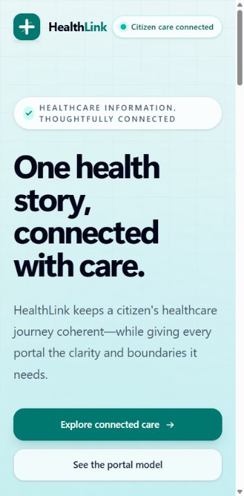

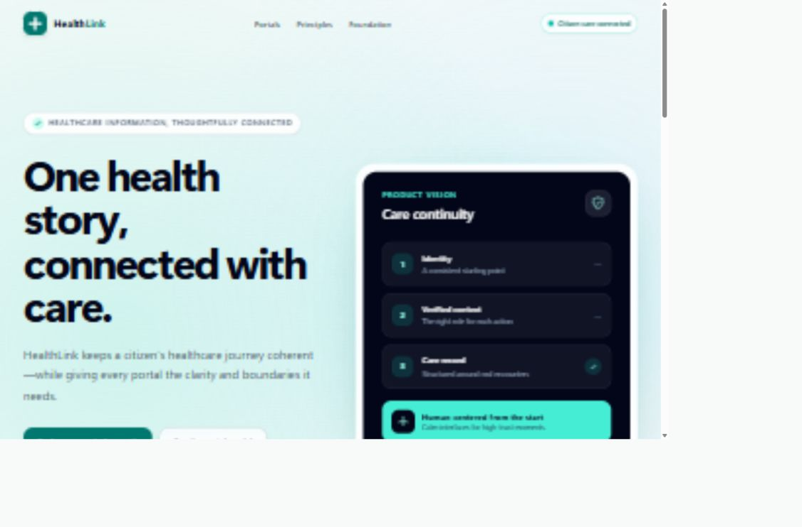

### Step 2 — Citizen sign-in: clear fields, missing recovery

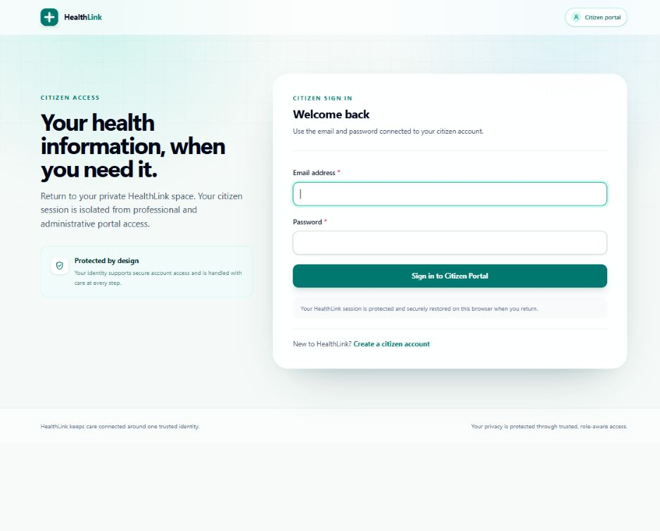

### Step 3 — Citizen registration: coherent but lengthy

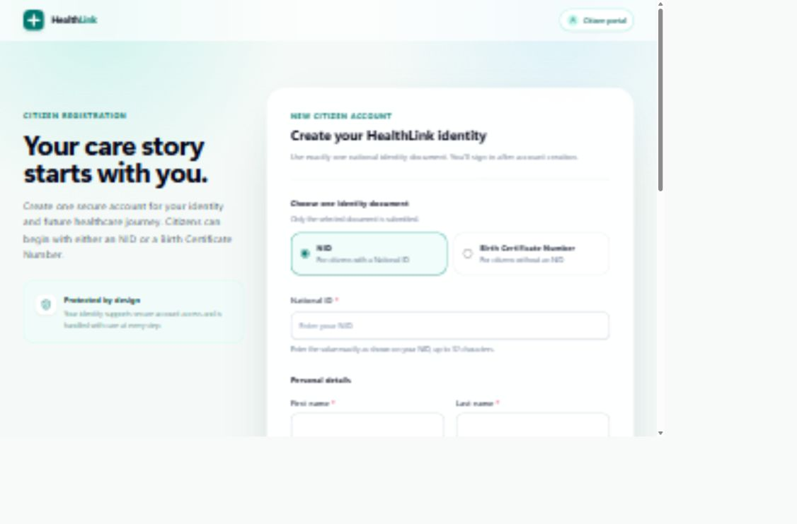

### Step 4 — Professional sign-in: role-aware but technical

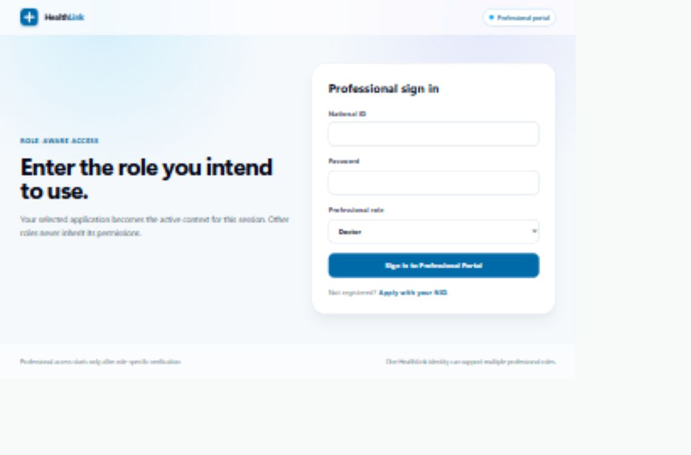

### Step 5 — Professional application: long form

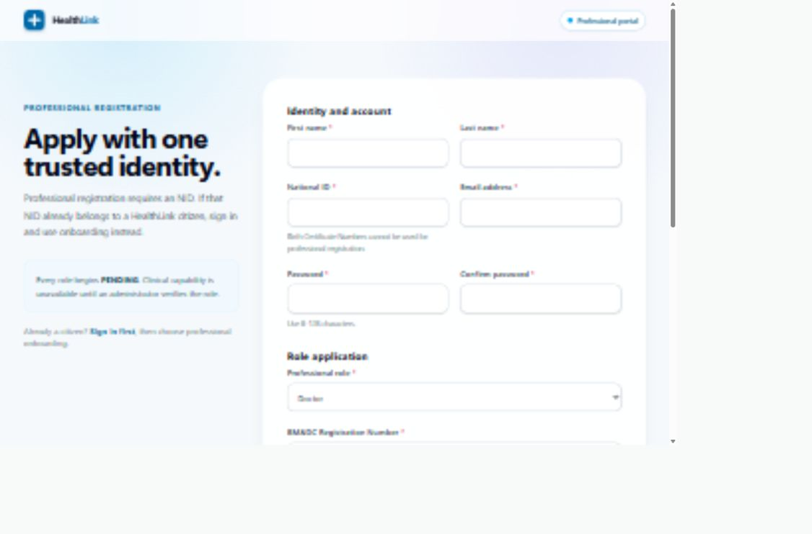

### Step 6 — Admin sign-in: clear restricted entry

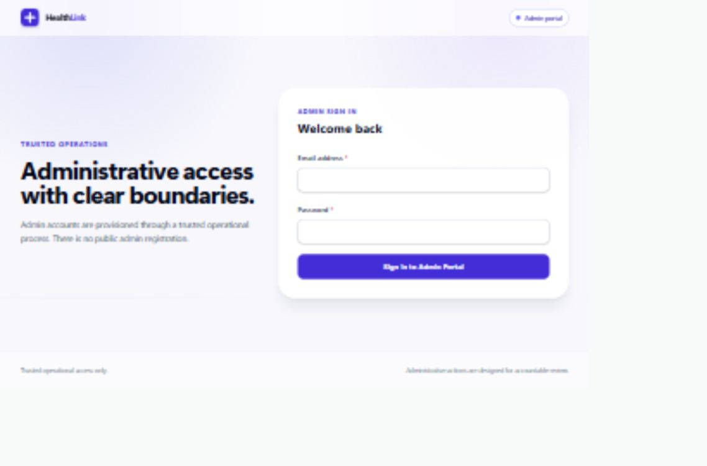

### Step 7 — Doctor-search guard: duplicate headers

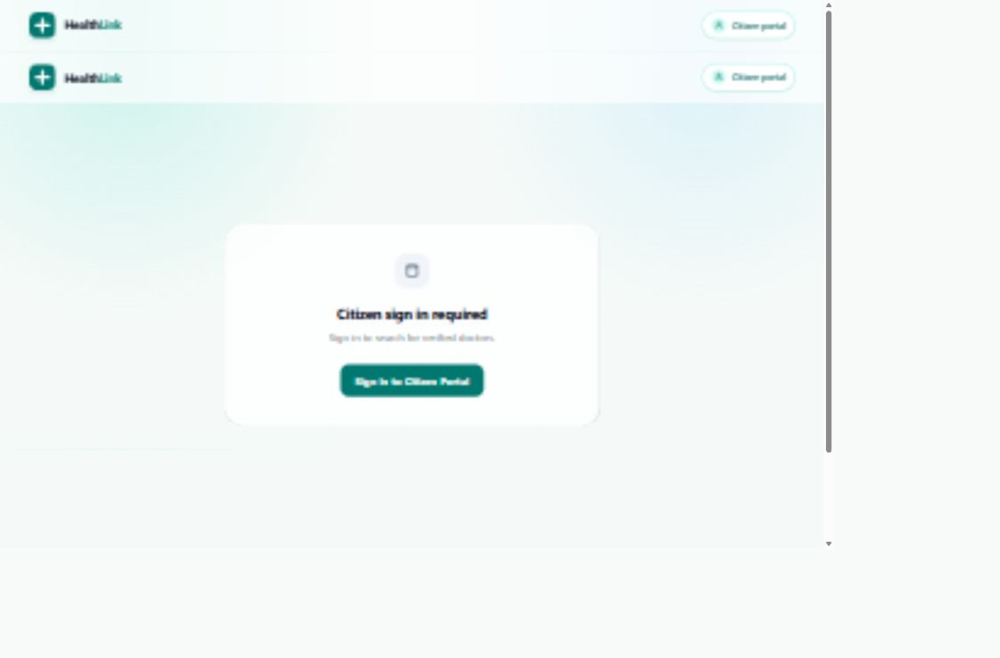

### Step 8 — Onboarding guard: sign-in required

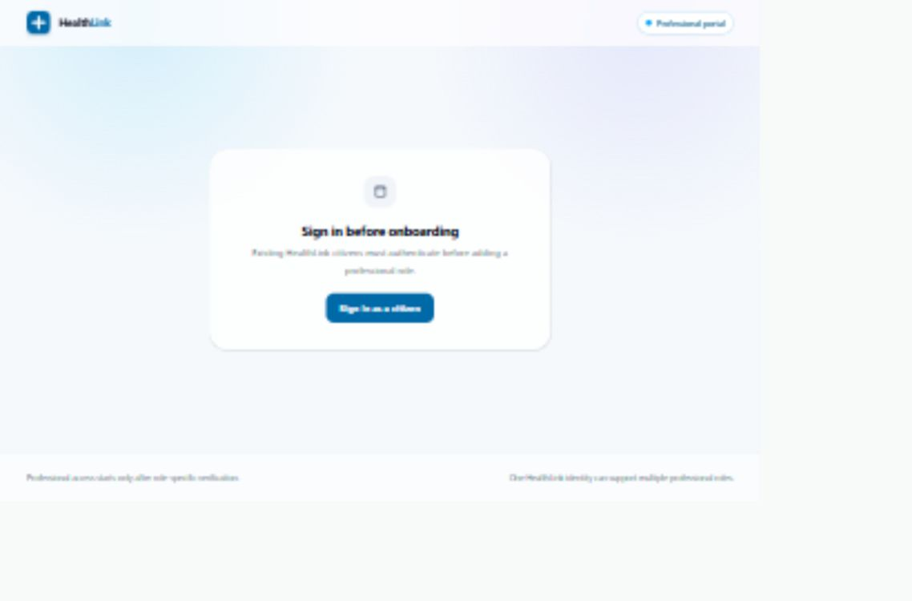

### Step 9 — Mobile forms: reflow works, task density needs attention

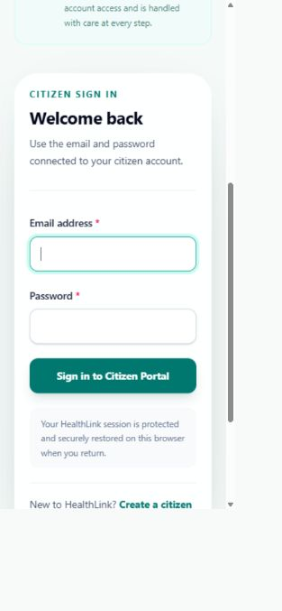

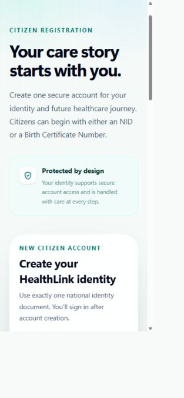
